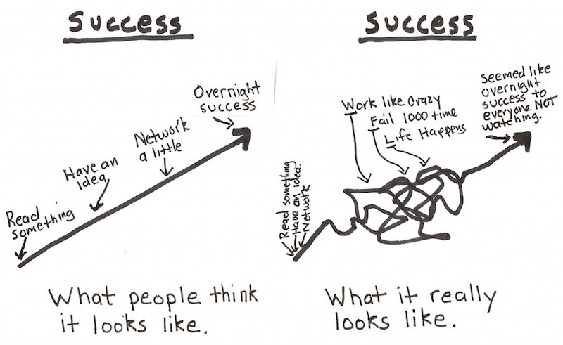

# Cohort 2 Internship Calendar

## At a Glance

Date    | Week                                | Topics
--------|-------------------------------------|-----------------------------
Mar 9   | Week 00                             | NO CLASS
Mar 17  | [Week 01](#week-1-of-internships)   | Language Specific Mini-Project
Mar 24  | [Week 02](#week-2-of-internships)   | Personal Projects: Importance/Finding, OS Contribution
Mar 31  | [Week 03](#week-3-of-internships)   | Tackling hard projects
Apr 7   | [Week 04](#week-4-of-internships)   | Youth Apps, Leveraging your coworkers
Apr 14  | [Week 05](#week-5-of-internships)   | Youth Apps, CS ADTs
Apr 21  | [Week 06](#week-6-of-internships)   | Youth Apps, Addressing difficult situations
Apr 28  | [Week 07](#week-7-of-internships)   | Youth Apps,
May 5   | [Week 08](#week-8-of-internships)   | Confidence in Coding,
May 12  | [Week 09](#week-9-of-internships)   |
May 19  | [Week 10](#week-10-of-internships)  | Resumes, Portfolios, Selling yourself
May 26  | [Week 11](#week-11-of-internships)  | User Centered Design,
Jun 2   | [Week 12](#week-12-of-internships)  | Technical Interview Prep,
Jun 9   | [Week 13](#week-13-of-internships)  |
Jun 16  | [Week 14](#week-14-of-internships)  | Networking,
Jun 23  | [Week 15](#week-15-of-internships)  |
Jun 30  | [Week 16](#week-16-of-internships)  | Climbing the corporate ladder, Reflections
        |                                     | **GRADUATION**

<!--
Possible people to ask to speak:
- Elton: Networking
- Koz: Climbing the corporate ladder
- Blake: Leveraging your coworkers
- Margaeux:
- Adam:
- Andy: User Centered Design
-

Possible CS Fundamental topics:
- ADTs (LinkedList, Stack/Queue, Sets, Maps, Trees)
- Algorithms ()
- Efficiency - Big O
- Recursive vs Iterative Solutions
- Language pros and cons
- Compiled languages vs interpreted languages
- Dean's list:
CS (to be spread out throughout the year):
 - Thinking about collections: Bags, Stacks, and Queues
    * The simplest collection interface
    * Getting things back in order: LIFO and FIFO
 - Thinking about performance: Simplified Big-O
    * O(1): Hashes and lookup tables
    * O(n): Arrays and Enumerable methods
    * O(n^2) … O(n^k): Nested loops and matrices
 - Thinking about collections 2: Linked lists
 - Thinking about sorting
    * Bubble sort
    * Insertion sort
 - Thinking about sorting 2: Quicksort
   * The plan: divide and conquer
   * Pivots
 - Thinking about collections 3: Trees and Graphs
   * Parents and children
   * Tree height
   * BSTs
 - Pointers to advanced things
  * Heaps and priority queues
  * Hashes
  * Game CS: A*, quad trees, occlusion

-->

## Week 1 of Internships

| Time         | Topic                                    | With
|--------------|------------------------------------------|----------
| 1:00 - 2:00  | Social Time to chat about internships    |
| 2:00 - 2:30  | Doxing                                   | Irene from Context Relevant
| 2:30 - 3:30  | Internship Talk: First Week              | Crystal
| 3:30 - 5:00  | Intern-Lang-Secific Coding Project       | 

###[Language Specific Mini-Project - Josephus Problem](topic_resources/josephus.md)

## Week 2 of Internships

| Time         | Topic                                    | With
|--------------|------------------------------------------|----------
| 1:00 - 2:00  | Project Time                             |
| 2:00 - 3:00  | Personal Projects: Importance/Finding    |
| 3:00 - 5:00  | One-on-one / OS Contribution Kickoff     | Bookis

### Open Source Contributions

To give back to the community and to help keep up on code, try to identify an open
source opportunity that you can work on. Start by reading
[8 simple steps for contributing to open source](http://www.sitepoint.com/8-simple-steps-for-contributing-to-open-source/)
Then try to find a project to work on, which can be difficult, here are some ways to get

1. [Code Triage](http://www.codetriage.com/) and [Open Hatch](https://openhatch.org) are great tools to help search for projects
2. Find a suitable bug or request on [Github Issues](https://github.com/blog/831-issues-2)
3. If you ever wished "Geee... I wish gem X did Z", that may be a good opportunity to communicate with the author about adding the feature.
4. Whenever you experience a plain ol' bug in a gem, fix it and submit a pull request.

If you find a project that would allow for multiple contributors or pairing, share!

## Week 3 of Internships

| Time         | Topic                                    | With
|--------------|------------------------------------------|----------
| 1:00 - 2:00  | Read/Watch Hsing-Hui and Liz's Talk      |
| 2:00 - 2:30  | Internship Talk: Challenges              |
| 2:30 - 3:30  | Tackling hard projects                   | ??
| 3:30 - 5:00  | One-on-one / Project Time                |

###Cohort 1 Hsing-Hui Hsu and Liz Rush: [Cascadia Ruby 2014 Talk](http://lizmrush.com/cascadia-ruby-2014/) [Video Version](http://confreaks.tv/videos/cascadiaruby2014-good-luck-with-that-tag-teaming-civic-data)
- How did they tackle hard problems?
- What lessons can you glean from their experience?

## Week 4 of Internships

| Time         | Topic                                    | With
|--------------|------------------------------------------|----------
| 1:00 - 2:00  | Youth Apps Training                      | Peter
| 3:00 - 4:00  | Leveraging your coworkers                | ??
| 4:00 - 5:00  | One-on-one / Project Time                |

## Week 5 of Internships

| Time         | Topic                                    | With
|--------------|------------------------------------------|----------
| 1:00 - 3:00  | Youth Apps Judging                       |
| 3:00 - 4:00  | CS ADTs                                  | Crystal
| 4:00 - 5:00  | One-on-one / Project Time                |

## Week 6 of Internships

| Time         | Topic                                    | With
|--------------|------------------------------------------|----------
| 1:00 - 2:00  | Youth Apps Judging                       |

## Week 7 of Internships

| Time         | Topic                                    | With
|--------------|------------------------------------------|----------
| 1:00 - 2:00  | Youth Apps Judging                       |

## Week 8 of Internships

## Week 9 of Internships

## Week 10 of Internships

## Week 11 of Internships

## Week 12 of Internships

## Week 13 of Internships

## Week 14 of Internships

## Week 15 of Internships

## Week 16 of Internships
