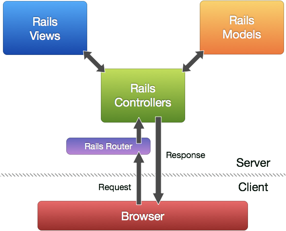

# The MVC Pattern: Model View Controller

MVC was devised in '79 by the folks working on Smalltalk, which is one of the core influences of Ruby. What we call MVC today, especially in the realm of web stack, is pretty different than that original specification, but the core principles have help true.

Essentially, MVC is way to divide responsibilities to complete a task. It's especially well suited to object oriented programming because of the focus on messaging between objects.

## The Model
- Contains data for the application (often linked to a database)
- Contains state of the application (e.g. what orders a customer has)
- No knowledge of user interfaces, so it can be reused

## The View
- Generates the user interface which presents data to the user
- Passive, i.e. doesn’t do any processing
- Views work is done once the data is displayed to the user.
- Many views can access the same model for different reasons

## The Controller
- Receive events from the outside world (usually from views)
- Interact with the model
- Determine the next step in the process flow
- Often responsible for notifying the View of state changes

We can think of each of these roles as the responsibility of an object, and use those responsibilities to organize a web service, like this:

