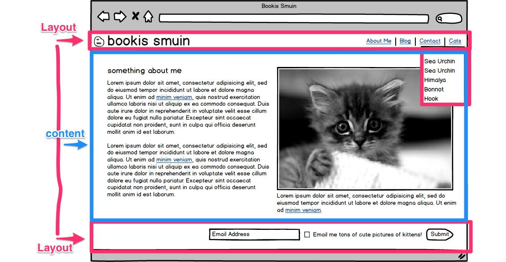

## Building a Blog (...again)

We will be adding a blog to our [Personal Website](https://github.com/Ada-Developers-Academy/daily-curriculum/blob/master/week5/monday/personal-website-overview.md). 

In this exercise we will:

- Add a layout template to a Sinatra application
- Add a directory to serve blog posts written in HTML
- Create a route in Sinatra that will dynamically serve pages from the new directory
- Create a way to access all of the blog post names to display and link to from our views.

#### Layouts

Our blog will have several posts written in HTML, each of the posts will have the same layout.

In Sinatra the default layout file is called `layout.erb` and lives within the `views` directory. Create the file:

    touch views/layout.erb
    
Now if we reload our page everything will be gone. Sinatra has detected that we now have a `layout.erb` file, so it's loading that file. But in our `my_app.rb` we are indicating that we want to load the `index.erb` file.

    get "/" do
      erb :index
    end
    
So our application is trying to render two files? Yes! First the `layout.erb` is loaded. So let's pull out the HTML sections that we want in our layout.

    <!DOCTYPE html>
    <html>
      <head>
        <link  href="/css/main.css" media="all" rel="stylesheet">
        <title>Bookis Smuin</title>
      </head>
      <body>
        

          Bookis Smuin
        

        <!-- OUR OTHER CONTENT WAS HERE -->
        

          I'm a footer
        

        </body>
      </html>
      
Now if we reload our page we will see only the content that we added to `layout.erb`. We need to define where within `layout.erb` we want the content to be rendered. The magic line is:

    <%= yield %>
    
This is really non-descriptive. It renders the erb template that we defined in `my_app.rb`, in this case it's `index.erb`

Tada. Now our view should look the same as it did before.

### Our blog structure

We are going to add plain HTML pages to our application as blog posts. The structure will look like

    sinatra_application/
        views/
            layout.erb
            index.erb
            posts/
                insert_post_name_here.erb
                some_other_name_here.erb
                and_a_third_name_here.erb
      
Let's start by creating the `dir` and files.

    mkdir views/posts
    touch views/posts/day_1.erb
    touch views/posts/my_first_ruby_event.erb
    touch views/posts/why_all_the_cats.erb
    
#### Defining routes with a parameter

Ok, so we have all of these files and we want to be able to serve each of them. How do we define routes in Sinatra?

    get "route_name" do
    
    end
    
Within the first argument to the `get` method we can use a **named parameter**. The named parameter is kind of a placeholder or wildcard for any word. The named parameter will become part of our `params` hash.

**Side note**: [How is params defined within Sinatra?](params_hash.md)

For instance, in our `my_app.rb`, if we define a route like so:

    get "/blog/:post_name" do
      
    end
    
When we send a request to the route `http://localhost:9292/blog/day_1` our Sinatra application will match it to this route. The params hash would then have a key of `:post_name` with a value of `day1`

    {:post_name => "day1"}
    
Let's debug this a little bit. In your `my_app.rb`

    get "/blog/:post_name" do
      puts params.inspect
    end
    
Restart your server and browse to `http://localhost:9292/blog/day_1`. Then look at the Terminal window that is running your server. You should see something like this

    {"splat"=>[], "captures"=>["day_1"], "post_name"=>"day_1"}
    
We don't need to worry about the `splat` and `captures` keys for now. But, we can see that `post_name` has a value of `day_1`. Since we have access to this data, we can now render the file with the matching name.

    get "/blog/:post_name" do
      erb "/posts/#{params[:post_name]}".to_sym
    end
    
In this case we are giving a direct path to the file we want to render. Since the value of `params[:post_name]` is `day_1` this line is equivelant to

    erb :"/posts/day_1"
    
Now we can use any of the file names to pull up those specific posts.

    http://localhost:9292/blog/day_1
    http://localhost:9292/blog/my_first_ruby_event.erb
    http://localhost:9292/blog/why_all_the_cats.erb
    
Now to write a blog post, all you need to do is create a file within the `posts` directory and write! (and push to Heroku to publish)
    
-------

#### Linking to all of the posts

We can get all of the files that are in our `posts` directory by using the `Dir` ruby class. Specifically the `glob` method. Let's try it out in `irb`

    Dir.glob("views/posts/*.erb")
    # ["views/posts/day_1.erb", "views/posts/my_first_ruby_event.erb", "views/posts/why_all_the_cats.erb"]
    Dir.glob("views/posts/*.erb").map {|path| path.split("/").last }
    # ["day_1.erb", "my_first_ruby_event.erb", "why_all_the_cats.erb"] 
    Dir.glob("views/posts/*.erb").map {|path| path.split("/").last.gsub(".erb", "") }
    # ["day_1", "my_first_ruby_event", "why_all_the_cats"]
    
We can use this approach to get the file names. Assign, these names to an instance variable so that we can use it in our view:

    get "/" do
      @posts = Dir.glob("views/posts/*.erb").map {|path| path.split("/").last.gsub(".erb", "") }
      erb :index
    end

We can use these names to create a list of links in our `layout.erb` file.

    <ul>
      <% @posts.each do |post| %>
        <li><a href="/blog/<%= post %>"><%= post %></a></li>
      <% end %>
    </ul>
    
To allow the `@posts` variable to be available to all our routes, we can move it from the `get` block to a `before` block

    before do 
      @posts = Dir.glob("views/posts/*.erb").map {|path| path.split("/").last.gsub(".erb", "") }
    end
    
The `before` block is executed before every single request regardless of the route.

#### Extra Credit (although we're not getting credit for this)

- Refactor the `@posts` we use in both of our route definitions into a single method to be used by either route.
- Create a `/blog` route that displays the contents of all of the posts in a single file. (*hint*: the `erb` method can be used from within a view)
- Add meta data to the top of each post file to define the title and date of the post.