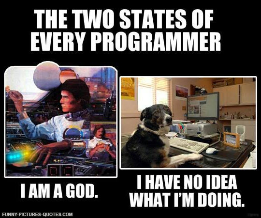

# What is Computer Science

I'm at Ada? I'm studying Computer Science? I'm a programmer? What is that anyway?

## define:Computer Science

[Wikipedia](http://en.wikipedia.org/wiki/Computer_science): "Computer science is the scientific and practical approach to computation and its applications. It is the systematic study of the feasibility, structure, expression, and mechanization of the methodical procedures (or algorithms) that underlie the acquisition, representation, processing, storage, communication of, and access to information, whether such information is encoded as bits in a computer memory or transcribed in genes and protein structures in a biological cell.[1] An alternate, more succinct definition of computer science is the study of automating algorithmic processes that scale. A computer scientist specializes in the theory of computation and the design of computational systems."

## What can you do with CS?

Most people think Microsoft, Google, Amazon, etc if you mention Computer Science. But there's so much more!

### Fields of Study

- Dev Ops
- Data Science
- HCD

## Who are the must knows?

- Alan Turing
- Ada Lovelace
- Grace Hopper
- Edsger Dijkstra
