# How To Turn In Your Projects

This is a step-by-step guide describing the git workflow we'll be using for every project that's assessed against a rubric. It involves both _cloning_ and _forking_ the project repo. In short, you will _clone_ the project repo, then create and _push_ a new branch that represents where your project will live when it is complete. Then you will _fork_ the project and code against the forked version of the branch you pushed to the project master. When you are ready for your code to be reviewed, you will _open a Pull Request_ to _merge_ your forked branch back into your branch on the project master.

Here's the detailed, step-by-step, version, using __Solar System__ as an example.

### Part 1: Setting up your space in the project master
1. I recommend you separate your _cloned_ project masters from your _forked_ working copies
  1. Go into your project folder (I keep mine in `~/projects/Ada/`): `$ cd ~/projects/Ada/`
  1. If you don't have one, make a directory for your _cloned_ project masters: `$ mkdir project-masters`
  1. If you don't have one, make a directory for your _cloned-and-forked_ working copies: `$ mkdir project-forks`
1. `cd` into your project masters folder: `$ cd ~/projects/Ada/project-masters` 
1. Find the url for _cloning_ the repo on its Github page: 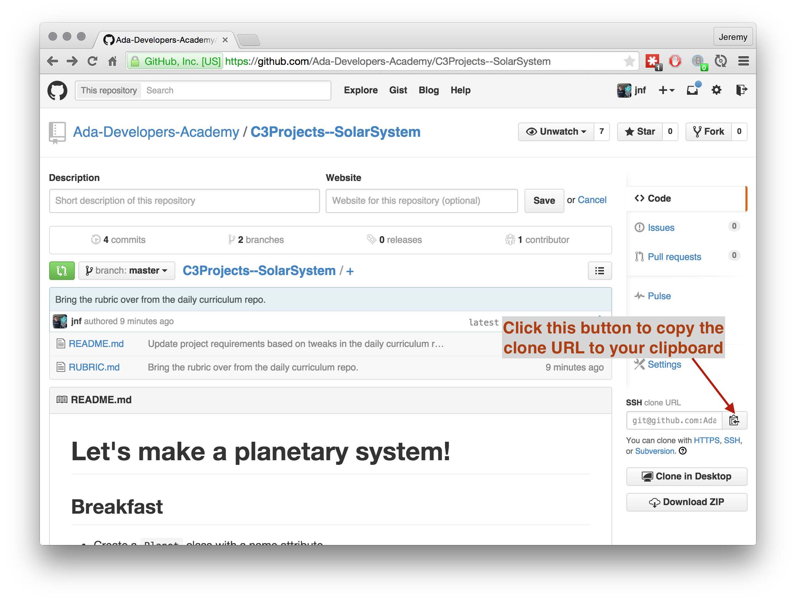
1. Clone the project master repo: `$ git clone git@github.com:Ada-Developers-Academy/C3Projects--SolarSystem.git` 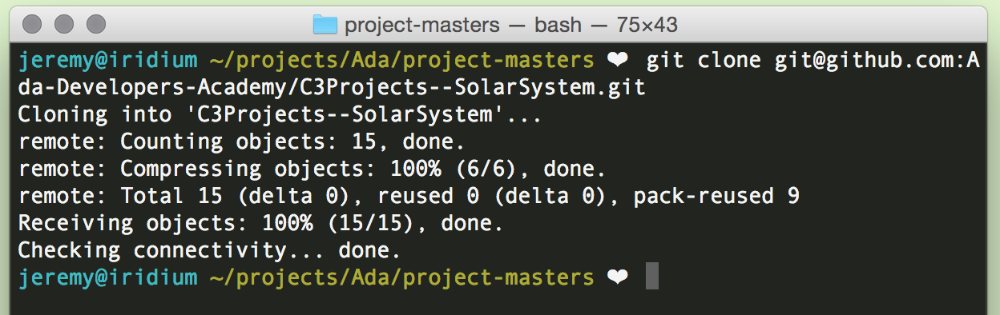
1. `cd` into the cloned repo directory: `$ cd C3Projects--SolarSystem/` 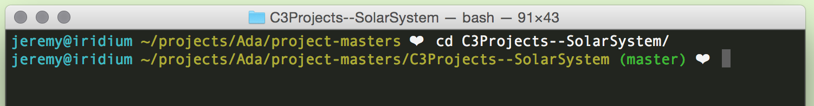
1. __CRITICAL__ Checkout a new local branch, with your initials in the branch name: `$ git checkout -b jnf/master` 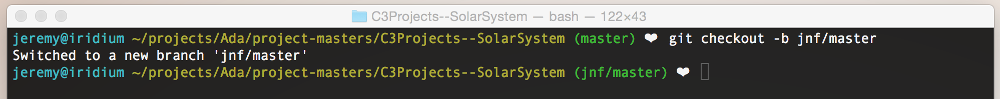
1. Open the project directory in your editor: `$ subl .` or `$ atom .`
1. Open `RUBRIC.md`, then edit the first line to include your name: 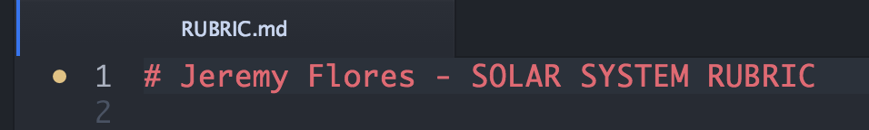
1. `$ git status` should report that you have a file change to commit: 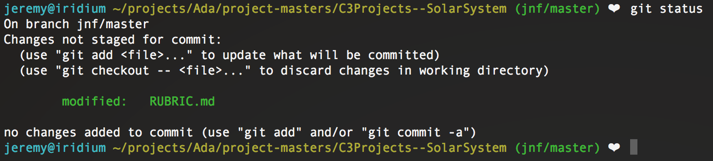
1. Commit the changed rubric to your local branch: `$ git commit RUBRIC.md -m "Added my name to the rubric."` 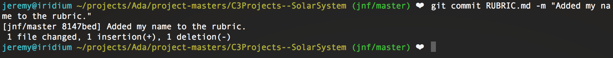
1. Push your changes upstream to Github.: `$ git push -u origin jnf/master` 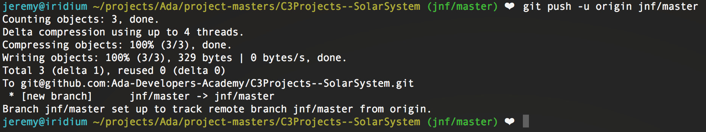

### Part 2: Forking the project to create your own working version
1. Go back to the Github page for the project, then _fork_ the project to your Github account: 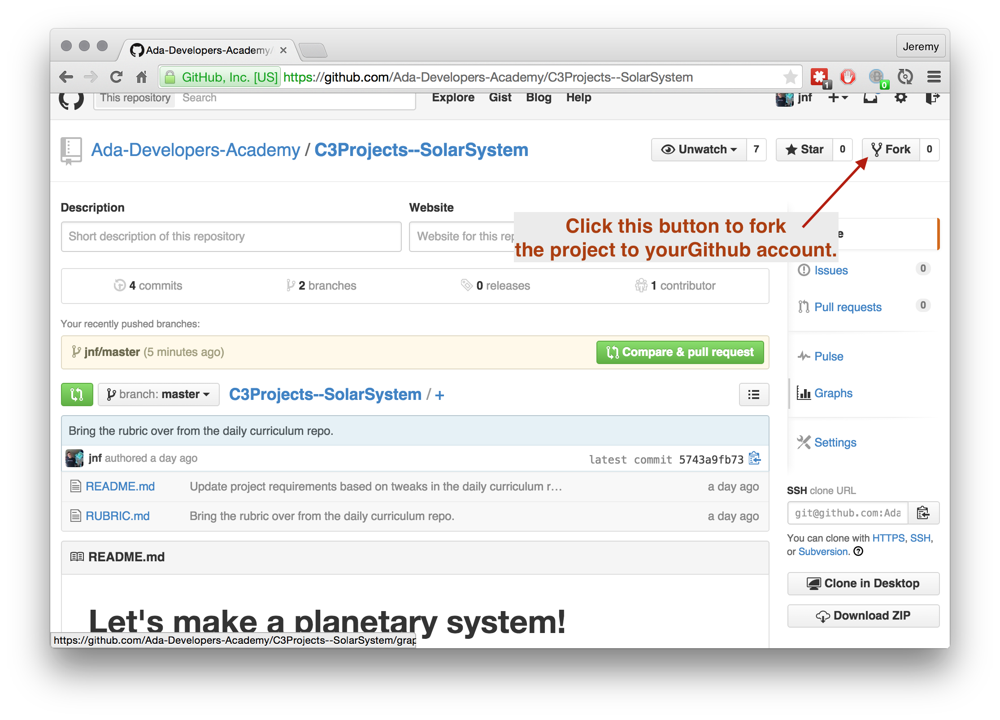
1. `cd` to your forked-project directory: `$ cd ~/projects/Ada/project-forks/` 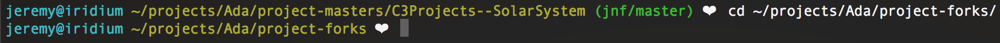
1. Find the URL to _clone_ your _fork_: 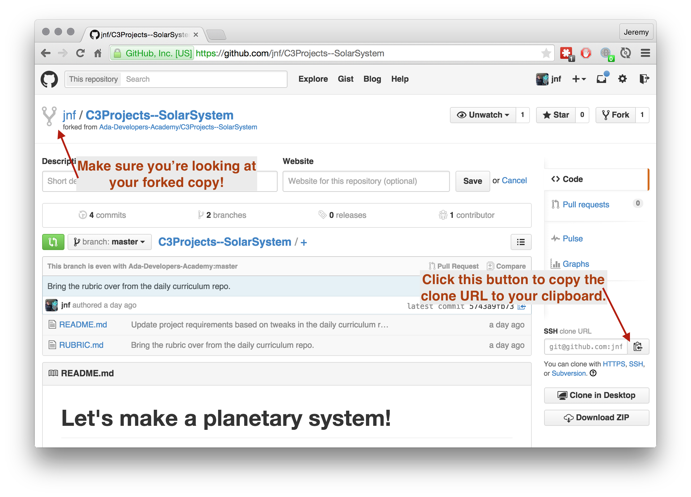
1. _Clone_ your fork: `$ git clone git@github.com:jnf/C3Projects--SolarSystem.git` 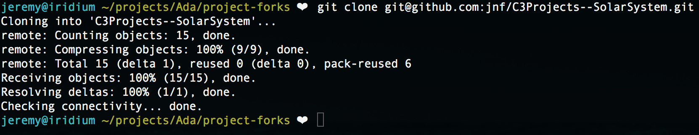
1. `cd` into your cloned project: `$ cd C3Projects--SolarSystem/` 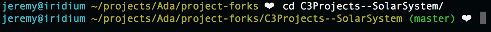
1. __CRITICAL__ Switch to your local branch; it already exists because it was part of the source project that you _forked_ and then _cloned_. `$ git checkout jnf/master` 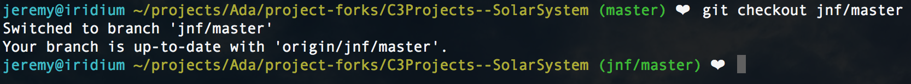
1. Open your editor here! `$ subl .` or `$ atom .`
1. __Complete your project. Create files, write code, stage and commit files.__ See [Git Immersion](http://gitimmersion.com/index.html) for help with using Git to stage, commit, and push your code to your _fork_ on Github.

### Part 3: Submitting your work for review via Pull Request
1. When you're ready for code review, make sure that all of your code has been committed and pushed to your _fork_ of the project.
1. Go to your _forked_ project's Github page in your browser.
1. Be sure you're looking at the _forked_ project by looking for the _fork_ symbol next to the repo name at the top of the page. You'll also see text like _forked from Ada-Developers-Academy/repo-name_ below the repo title.
1. Click the __branch__ button and select your project branch from the dropdown. This will reload the page to display your commit history on that branch: 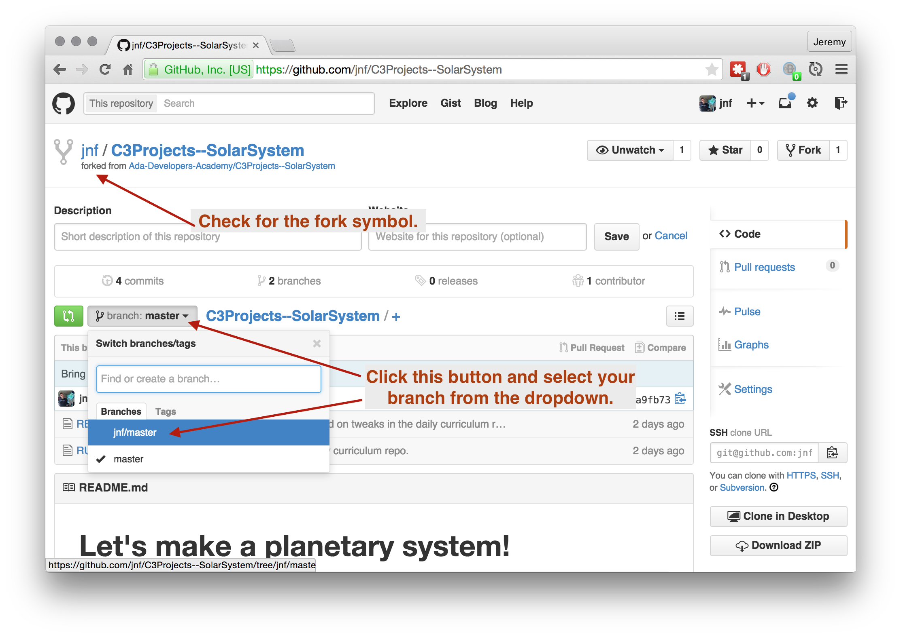
1. Verify that your branch is shown on the __branch__ button. Then click the green button next to the branch button to create a new __Pull Request__: 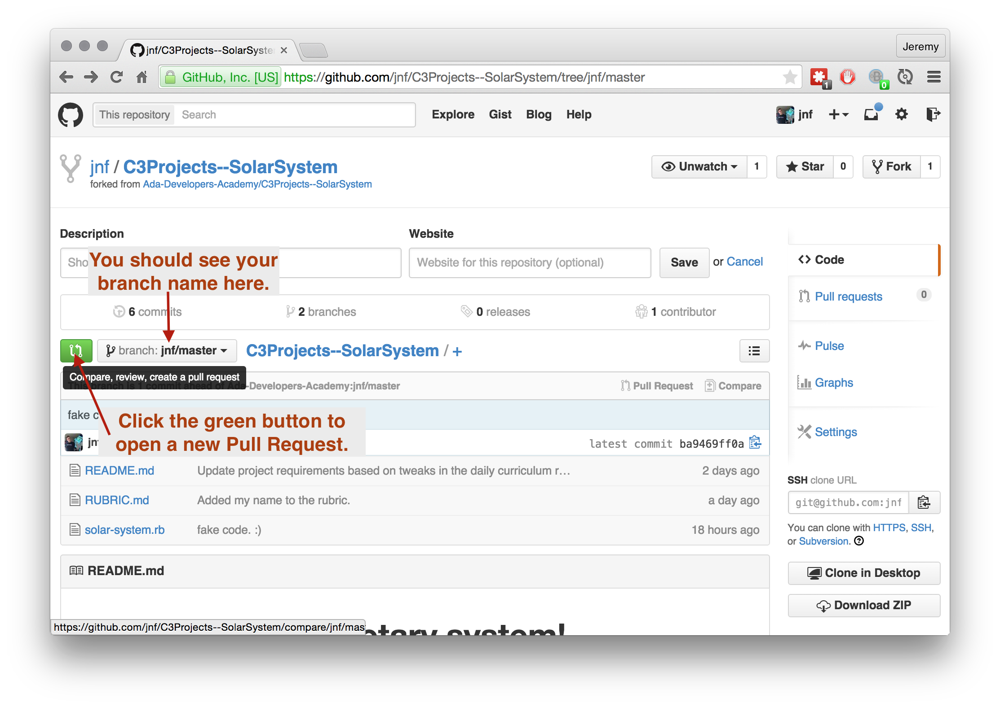
1. __CRITICAL__ On this page, verify that the _base fork_ reads `Ada-Developers-Academy/...` and that the _head fork_ begins with your Github username. Similary, verify that both the _base_ and _compare_ buttons are set to your project branch. In Github vernacular, you are requesting that the _base fork_ (Ada) _pull_ the code in your _head fork_'s branch into the matching branch on the _base fork_. 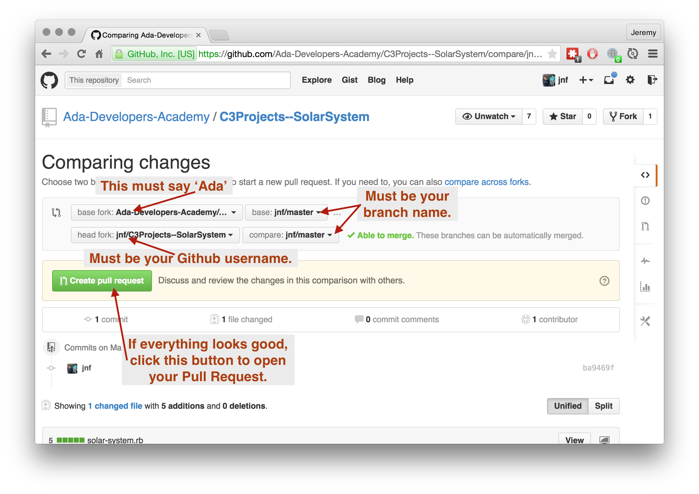
1. Again, take a moment to verify that the _base fork_ is Ada's Github and that the _head fork_ is yours. This is easy to mess up, which is why Github gives so many opportunities to doublecheck. Provide information about your project in the title/descritpion text fields. __You must explicitely state which project tiers (Breakfast, Lunch, Dinner, Desert) your project includes!__ When you finish writing your descriptions, click the green __Create Pull Request__ button to open your PR. 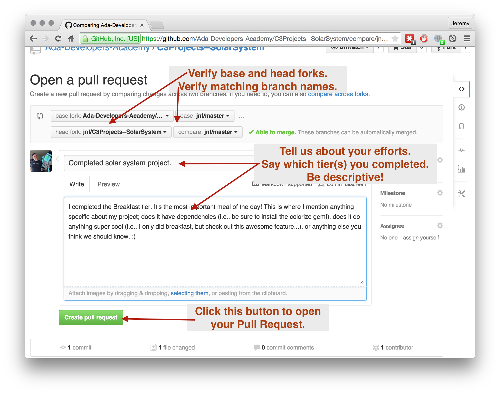
1. Your Pull Request is open! Your Pull Request is awesome! Instructors/Code Reviewers will be reviewing your Pull Request and providing feedback based on the project rubric. :) 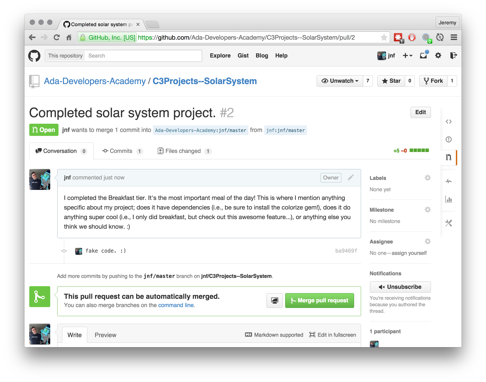

## Workflow Diagram

This diagram shows the entire workflow, but condenses some of the steps listed above. I've included it here for reference and clarity, but use the steps above to guarantee your projects are submitted correctly. 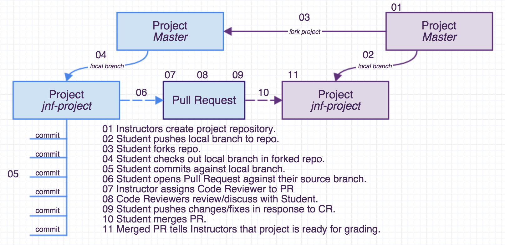

