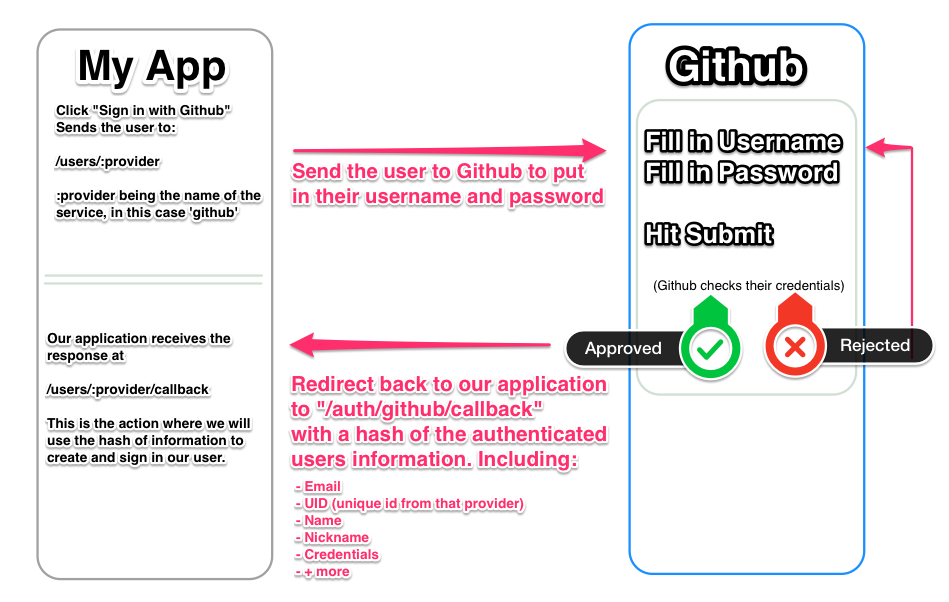
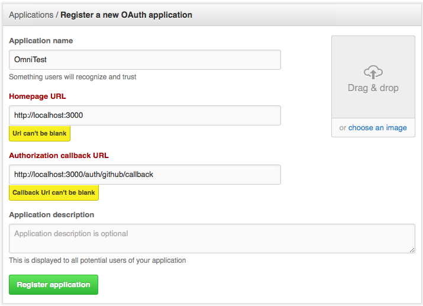
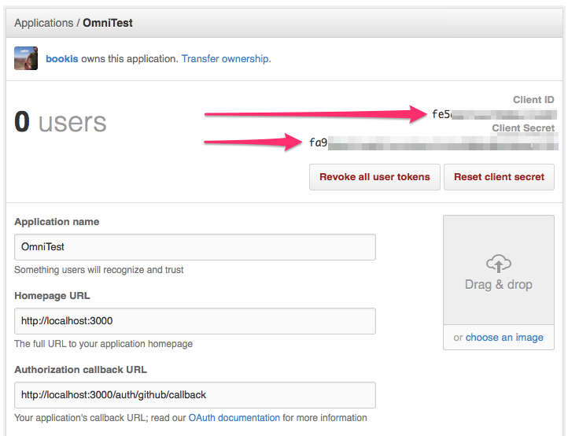

# Authentication w/ OmniAuth

OmniAuth is a gem that standardizes the authentication process using 3rd party providers. OmniAuth supports a ton of providers, a quick search shows over 150, some of the popular providers are:

- Twitter
- Facebook
- Github
- Heroku
- LinkdIn
- Netflix
- Paypal

In this lesson we will be creating a rails application that uses OmniAuth to authenticate new and returning users using Github.

### OmniAuth

The `OmniAuth` gem provides pretty much everything you need to use these services, starting with adding a couple routes to your application:

- `/auth/:provider`
- `/auth/:provider/callback`

In both of these examples `:provider` is a named parameter that will equal the name of the service we are using, in this example it will be `github`. These two routes in our application are how we start and end the authentication interaction with the provider, sending the user to `/auth/github`, will start the authentication process, when Github is finished authenticating them, they will be sent back to our application to the route `/auth/github/callback`



### Getting started

Enough with talking, lets implement this into a quick application. Head over to your sandbox (I keep mine in `~/sandbox`) and...

```bash
$ mkdir omni
$ echo '2.2.2' > omni/.ruby-version
$ echo 'omni' > omni/.ruby-gemset 
$ cd omni
$ gem install rails --no-ri --no-rdoc
$ rails new . -T
```

Open the Gemfile and add some gems:

```ruby
  gem "omniauth"
  gem "omniauth-github"

  group :development do
    gem "better_errors" # These two are just for debugging
    gem "binding_of_caller"
  end
```
Then `bundle install`, you notice that we have a specific gem for Github. Each provider has a small gem to add the functionality for that specific provider.

### Configuration

Each provider requires you to provide some credential for your application, so they can keep track of which website is authorizing which user. We can login to [Github](http://github.com) and register a new "application" here [https://github.com/settings/applications/new](https://github.com/settings/applications/new)



After registration you will be given a `client id` and a `client secret`:



**Note:** These are essentially passwords to your Github account, keep them safe, never post them in public places or commit them in git.

Now that we have our credentials, we can configure our rails application, we will do this in an initializer file, initializers are files that run as a rails application starts, any file inside of `config/initializers/` are loaded.

```
touch config/initializers/omniauth.rb
```

Inside of this new file, add this configuration:

```ruby  
# config/initializers/omniauth.rb
Rails.application.config.middleware.use OmniAuth::Builder do
  provider :github, YOUR_CLIENT_ID, YOUR_CLIENT_SECRET
end
```

We don't want to commit our id or secret to github, so we can use what is called
an "environment variable". Basically there is a constant called `ENV` which is a hash
of data read into memory when ruby was loaded.

We can use a gem called [dotenv-rails](https://github.com/bkeepers/dotenv) to help us
manage our environment variables.

```ruby
#Gemfile
gem 'dotenv-rails', :groups => [:development, :test]
```

```ruby
#omni/.env
GITHUB_CLIENT_ID: fd6XXXXXXXX
GITHUB_CLIENT_SECRET: y6wXXXXXXX
```
This will load these key/values as environment variables in our rails app, so now the `config/initializers/omniauth.rb` can be changed to:

```ruby
Rails.application.config.middleware.use OmniAuth::Builder do
  provider :github, ENV["GITHUB_CLIENT_ID"], ENV["GITHUB_CLIENT_SECRET"]
end
```

Whew... done with configuration

### Implementing Users

Boot your rails app and go to `/auth/github`. Amazingly, this sends us to Github to login and grant permission! When we proceed we end up back at `localhost:3000/auth/github/callback` and we can see a bunch of information in the url parameters. Let's add this route to our `routes.rb` so we can see what the response has to offer:

    get "/auth/:provider/callback", to: "sessions#create"

I've made the route point to a sessions controller to the create action, you could send it anywhere, but creating a new session for our user makes sense, so we'll call it sessions. Let's create this controller and action

    touch app/controllers/sessions_controller.rb

Now build this controller with a `create` action:
```ruby
class SessionsController < ApplicationController

  def create
    auth_hash = request.env['omniauth.auth']
    raise
  end

end
```
We're assigning a variable to `request.env['omniauth.auth']`. This is information stored in the `headers` of the HTTP request. This data is a hash, you can see all of the likely keys this hash will have in the [OmniAuth README](https://github.com/intridea/omniauth/wiki/Auth-Hash-Schema), but the key/values returned varies by provider (there's lots of documentation reading in our future). Github will return the following important keys:

```ruby
# the `uid` is an identifier for the user from the provider's system
# using it plus the provider type (github in this case),
# we can uniquely identify a user
auth_hash["uid"]

# the info hash contains specifics of the user's account
auth_hash["info"]["name"]
auth_hash["info"]["email"]
auth_hash["info"]["image"]
auth_hash["info"]["nickname"]
```

We can use the above information returned by Github to create a user.

### Creating Users

We'll create a user model and use TDD to implement the OmniAuth creation of a user
```ruby
# Gemfile
group :development do
  gem 'rspec-rails'
end
```

```bash
  rails g rspec:install
  rails g model user username:string email:string uid:string provider:string avatar_url:string
  rake db:migrate
  rake db:test:prepare
```

Next we'll add some configuration and specs to test the creation of users with OmniAuth:

```ruby
# /spec/spec_helper.rb

## The following goes inside the `Rspec.configure` block:
config.before(:suite) do
  # Once you have enabled test mode, all requests
  # to OmniAuth will be short circuited
  # to use the mock authentication hash.
  # A request to /auth/provider will redirect
  # immediately to /auth/provider/callback.

  OmniAuth.config.test_mode = true

  # The mock_auth configuration allows you to
  # set per-provider (or default) authentication
  # hashes to return during testing.

  OmniAuth.config.mock_auth[:github] = OmniAuth::AuthHash.new({:provider => 'github', :uid => '123545', info: {email: "a@b.com", nickname: "Ada"}})
end
```

```ruby
# /spec/models/user_spec.rb

require 'spec_helper'
require 'rails_helper'

RSpec.describe User, type: :model do
  let(:user) { User.new(
    email:    "a@b.com",
    username: "Ada",
    uid:      "1234",
    provider: "github")
  }

  describe "validations" do
    it "is valid" do
      expect(user).to be_valid
    end

    it "requires an email" do
      user.email = nil
      expect(user).to be_invalid
    end

    it "requires a username" do
      user.username = nil
      expect(user).to be_invalid
    end

    it "requires a uid" do
      user.uid = nil
      expect(user).to be_invalid
    end

    it "requires a provider" do
      user.provider = nil
      expect(user).to be_invalid
    end
  end


  describe ".initialize_from_omniauth" do
    let(:user) { User.find_or_create_from_omniauth(OmniAuth.config.mock_auth[:github]) }

    it "creates a valid user" do
      expect(user).to be_valid
    end

    context "when it's invalid" do
      it "returns nil" do
        user = User.find_or_create_from_omniauth({"uid" => "123", "info" => {}})
        expect(user).to be_nil
      end
    end
  end
end
```

To fix the rspec failures we would add the following to our `app/models/user.rb`

```ruby
class User < ActiveRecord::Base
  validates :email, :username, :uid, :provider, presence: true

  def self.find_or_create_from_omniauth(auth_hash)
    # Find or create a user
  end

  def self.create_from_omniauth(auth_hash)
    # Create a user
  end
end
```

### Receiving the request

Now we have the functionality to initialize a user using the hash that will be return from the provider request, lets TDD `sessions_controller#create`:

##### Let's set a `root_path` to make things easier for us:
```ruby
  # in config/routes.rb
  root to: "users#show"
```

##### Generate a controller spec
```bash
  $ rails g rspec:controller sessions
```

##### And now some tests:
```ruby
# spec/controllers/sessions_controller_spec.rb
require 'spec_helper'
require 'rails_helper'

RSpec.describe SessionsController, type: :controller  do
  describe "GET #create" do
    context "when using github authorization" do
      context "is successful" do
        before { request.env["omniauth.auth"] = OmniAuth.config.mock_auth[:github] }

        it "redirects to home page" do
          get :create, provider: :github
          expect(response).to redirect_to root_path
        end

        it "creates a user" do
          expect { get :create, provider: :github }.to change(User, :count).by(1)
        end

        it "assigns the @user var" do
          get :create, provider: :github
          expect(assigns(:user)).to be_an_instance_of User
        end

        it "assigns the session[:user_id]" do
          get :create, provider: :github
          expect(session[:user_id]).to eq assigns(:user).id
        end

      end

      context "when the user has already signed up" do
        before { request.env["omniauth.auth"] = OmniAuth.config.mock_auth[:github] }
        let!(:user) { User.find_or_create_from_omniauth(OmniAuth.config.mock_auth[:github]) }

        it "doesn't create another user" do
          expect { get :create, provider: :github }.to_not change(User, :count).by(1)
        end

        it "assigns the session[:user_id]" do
          get :create, provider: :github
          expect(session[:user_id]).to eq user.id
        end
      end

      context "fails on github" do
        before { request.env["omniauth.auth"] = :invalid_credential }

        it "redirect to home with flash error" do
          get :create, provider: :github
          expect(response).to redirect_to root_path
          expect(flash[:notice]).to include "Failed to authenticate"
        end
      end

      context "when failing to save the user" do
        before {
          request.env["omniauth.auth"] = {"uid" => "1234", "info" => {}}
        }

        it "redirect to home with flash error" do
          get :create, provider: :github
          expect(response).to redirect_to root_path
          expect(flash[:notice]).to include "Failed to save the user"
        end
      end
    end
  end
end
```
```ruby
# app/controllers/sessions_controller.rb
class SessionsController < ApplicationController

  def create
    auth_hash = request.env['omniauth.auth']
    if auth_hash["uid"]
      @user = User.find_or_create_from_omniauth(auth_hash)
      if @user
        session[:user_id] = @user.id
        redirect_to root_path
      else
        redirect_to root_path, notice: "Failed to save the user"
      end
    else
      redirect_to root_path, notice: "Failed to authenticate"
    end
  end

end
```
### Showing the User

Next we'll quickly create a show page to redirect to after we login:

    rails g controller users show

app/controllers/application_controller.rb
```ruby
    helper_method :current_user

    def current_user
      @current_user ||= User.find(session[:user_id]) if session[:user_id]
    end    
```
app/views/users/show.html.erb

    <%= image_tag current_user.avatar_url %>
    <h1><%= current_user.username %></h1>
    <b><%= current_user.email %></b>

Resources
----------

[Environment variables on Heroku](https://devcenter.heroku.com/articles/config-vars)
