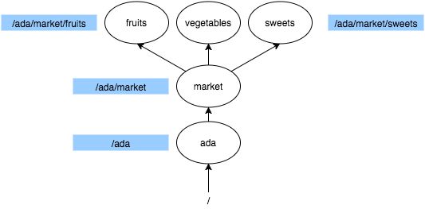

# Problem Solving Interview: Command Line Interface

# Outline
1. Command Line Interface
  1. What is the CLI?
  1. Why do we want to use the CLI?
  1. How can we use the CLI?
  1. What is a command?
  1. What is output?
1. Directores
  1. What is a directory?
  1. Directory structure
  1. Directory trees
  1. Paths
  1. CLI and the Present Directory
  1. Directory commands

# Command Line Interface
## What is the CLI?
  * Text-based rather than graphical (GUI)
  * Uses a program called a **terminal**
  * The terminal operates in a repeating sequence of steps:
    1. Displays a single line of text known as a **prompt**
    1. Accepts a single line of text known as a **command**
    1. When commands are entered, **executes** (or **runs**) them
    1. Displays the **output** (or **result**) of executing commands
    1. Finally, repeats with step 1

## Why do we use the CLI?
  * Text entry is more precise than using the mouse
  * Text entry and keyboard "shorcuts" are faster
  * As programmers we can create complex commands and run them many times

## What is a command?
  * Commands are actions that we wish to take using our computer
  * Frequently they are things we have done before using the GUI
  * Examples: Creating a new directory or file, moving a file, deleting a file
  * Every command has three parts:
    * **Command name** - Specifies the particular command we wish to use
    * **Options** - Optional information that can modify the command's behavior
    * **Arguments** - Additional information required for the command to properly execute

## What is output?
  * Textual information displayed by the computer as a result of running a command
  * Can be any amount of text (one or more lines)
  * Frequently the output is blank/empty if the command executed successfully
  * In other cases, the output is an **error message** indicating that the command did not execute successfully, and why

# Directories
## What is a directory?
  * **Directories** are also commonly known as **folders**
  * They represent a location within your computer, and have a **name** to indicate their purpose/contents
  * They act as containers -- **files** and other directories can be placed "inside" of them

## Directory structure
  * Directories contain files and other directories
  * For every file or directory on your computer, the directory that contains it is called the **parent** directory
  * Similarly the files and directories within a given directory are known as its **children**
  * There is one directory on your computer which has no parent, it is called the **root** directory

## Directory trees
  * Based on the terminology in the previous section, you may be imagining a "family tree" kind of diagram for the relationship between directories on your computer
  * This is a great metaphor for visualizing the structure of directory "trees"
  * Because directories have names just like people do, we can create a tree diagram showing all of the directories on a computer:

## Paths
  * A **path** is a text representation for a sequence of child directories used to indicate a particular directory or file relative to the root directory
  * Using the family tree metaphor, you can think of a path as something like "Audamar is the son of Avice who is the daughter of Liron who is the son of Layla"
  * However, with computer paths we specify the root directory first going from left to right, so we would say something like "Layla's child Liron's child Avice's child Audamar"
  * Furthermore, we use just a `/` (forward slash) character to indicate the separation between parent and child: `Layla/Liron/Avice/Audamar`
  * In the example above, "Layla", "Liron", "Avice", and "Audamar" would be directory names.
  * Finally there is a special directory name which can be used to indicate the parent directory: `..` With the example above, we could say `Layla/Liron/Avice/../..` and this would be equivalent to "Layla's child Liron's child Avice's parent's parent" -- which is "Layla".

## CLI and the Present Directory
  * When using the CLI, our commands always execute at a particular location -- within a particular directory
  * We can see our current location, known as the **present working directory** by using the `pwd` command
  * Whenever we specify a path to a command in the CLI, it is either relative or absolute
    * **Relative** paths DO NOT start with a `/` and the first directory name is assumed to be a child of the present working directory
    * **Absolute** paths DO start with a `/` and the first directory name is assumed to be a child of the root directory

## Directory commands
  * We have already seen the `pwd` command which can be used to display the present working directory -- to find out where our CLI commands are located
  * Here are a few more commands we can use:
    * `ls` - <b>L</b>i<b>s</b>t Directory: Displays all of the child files and directories for the directory at the specified path.
    * `cd` - <b>C</b>hange <b>D</b>irectory: Puts the CLI in a different location (the specified path), all further commands execute at that location
    * `mkdir` - <b>M</b>a<b>k</b>e <b>Dir</b>ectory: Create a new directory at the path specified.
  * All of these commands accept an **argument** that is a directory path. When writing the command you specify the argument after the command name, separated by a space: `ls this/is/a/path`
