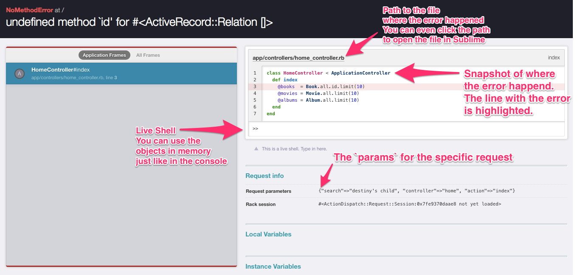
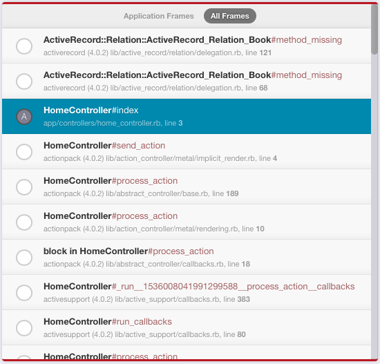
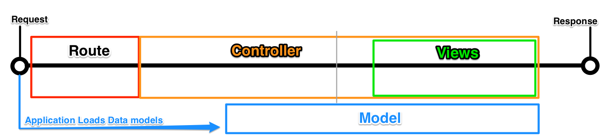

# Rails Request State

This lesson will describe the practice of tracking and identifying the state and scope at any point within a rails request.

### Better Errors

We will start by adding a tool to allow rails to generate better errors for us. The [Better_errors](https://github.com/charliesome/better_errors) gem will change the rails error page to be much more descriptive and add a "live shell" to inspect the objects currently in memory and scope at the time of the error. To add this functionality to any rails app just add the following to the `Gemfile`

    group :development do
      gem "better_errors"
      gem "binding_of_caller"
    end

The `gem "binding_of_caller"` gems enables some of the more advanced features of `better_errors`.

**NOTE**: ALWAYS wrap this gem in the development group, if the gem is available in your production environment you will open major security holes within your application.

Now, when our application comes across an error we will see an error message like this

There are a lot of helpful tools here, the main features are:

1. The clickable path the file where the error occurred..
2. Snapshot of the code, with the error line highlighted
3. A "live shell" which mimics your rails console, but it will have all of the current variables with their current values assigned
4. Request information, such as `params`

### Reading a `stack trace`

Clicking on the `All Frames` link within `bettor_errors` we can see a `stack` of different classes, methods, and files.

Ruby code works by calling a series of methods.  Each time a method is called, ruby adds the file and line that called the method to a history. Even the "magic" is recorded. A stack trace shows us this history of methods. A stack trace is composed of stack frames, with each stack frame indicating a call. The deepest frames  -- those called last before the error -- are the frames at the top. The stack trace is the same thing we see in our console, development logs, or regular rails error page with ruby. Learning to read it can be difficult, but it can be very useful.

If we take a look at the stack trace above we will see the error we encountered. The first two lines look really crazy. These were added *after* the error occurred, as the app was trying to figure out if it could rescue itself. The third line, highlighted, is where our error actually happened. Below that third line is the history of files, classes and methods leading up to the error -- most of which is more rails magic.

\* *This is a pretty crude description, but it illustrates what is happening*
### Debugging state

At any given moment running code has some definite state. If we were to stop code in it's tracks, there would be available variables that have some value, as well as the current object in memory i.e. `self`. Learning to figure out what the exact state of the application is when an error occurs is the best way to solve the problem. We've seen a few debugging techniques to determine the state of an application at a certain point in the code, using `raise`, `puts`, and `inspect`.

`better_errors` provides a very powerful tool to help with this during an error. Using the "live shell" we can type into this console to interact, query, and inspect all of the variables, objects, and methods available at the state when the error happened.

### Differentiating Rails Components

In the rails request cycle, we jump through some major components, routes, controllers, views, and models. Each of these components can be visualized along the timeline of the request cycle like this:

We can define a couple rules based on this representation for how the state should act.

1. Instance Variables can go from parent to child squares, but they cannot cross between boxes without any overlap
2. The `request` data (`params`, `session`, `request`) is available within "Controllers" and it's children.
3. Controller methods (`render`, `redirect_to`, and any custom methods) are only available within "Controllers", not it's children.
4. "helper" methods (`link_to`, `image_tag`, `form_for`, and anything you define in any file in the `helpers` dir) are available only to "Views", not it's parents.

#### Identifying state

Given these tools we can determine:

1. What the current idea of `self` is and the current scope.
2. Which variables are available, and what their current values are.
3. Where the application has previously run.
4. Gather data from the request.
5. Test data and methods on the current state.

Determine and give an example of the 5 ideas listed above for the error raised in the following code on line 6:

    1 class HomeController < ApplicationController
    2   def index
    3     @books  = Book.all.limit(10)
    4     @movies = Movie.all.limit(10)
    5     @albums = Album.all.limit(10)
    6     raise "Stop the code here!"
    7   end
    8 end
