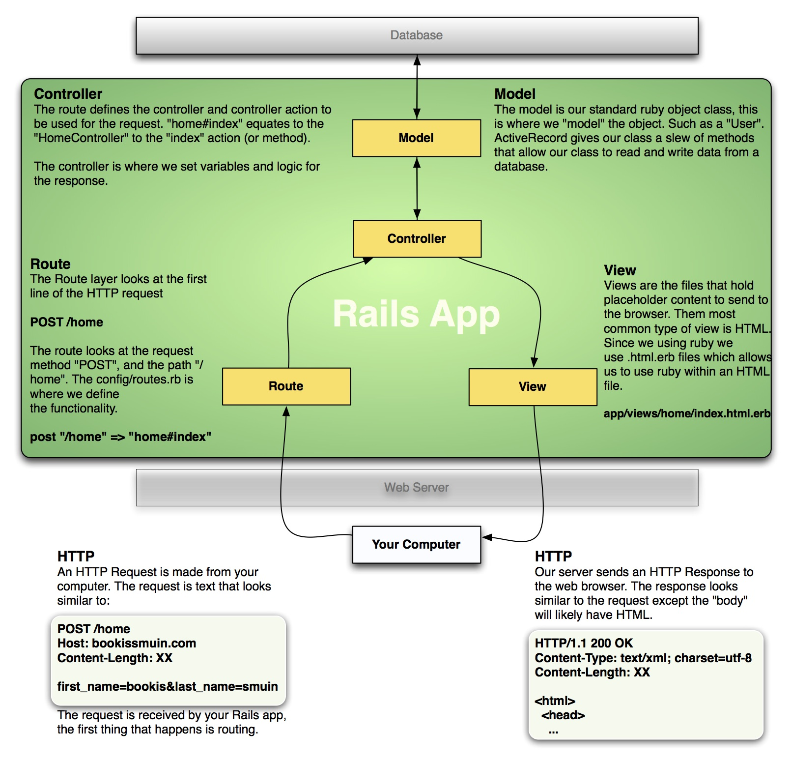

# Routes & REST

Named Routes
-------------
We've seen the basic syntax for creating a route within an application, in the routes.rb:

```ruby
get "/pineapple", to: "home#index"
```

Let's imaging a problematic scenario. We have a large application, 20+ pages, which includes the above route.
This `pineapple` route is linked to on many of the pages, and from many controllers using `redirect_to`.
What if Snapple™ decided to sponsor, they want this path changed to `/pinesnapple`.
Now it is your job to track down every place where this link exists and change it. No fun.

Using a Named Route we can avoid this problem. By giving each route definition within the `routes.rb` a "name",
we can then refer to it by name when creating links and redirects.

```ruby
get "/pineapple", to: "home#index", as: :fruit
```

This creates a controller/view helper method, which generates the path for us, simply by refering to the name. In a controller or view:

```ruby
fruit_path # => "/pineapple"
```

*note*: The `_path` is added to the end of all named routes.

```ruby
get "/pinesnapple", to: "home#index", as: :fruit
fruit_path # => "/pinesnapple"
```

REST
-----

Representational state transfer (REST) is an architectual style. This is a recommendation for the structure and style in which
a resource (ruby object) can be represetned and managed through a web server.

The core of this idea can be described through routing. We'll look at an example if we have a `Market` object we want to represent through a web server.

|PATH        | METHOD| DESCRIPTION|
|:----------:|:-----:|:-----------|
| /markets       | GET    | Retrieves a collection of market objects|
|                | POST   | Creates a market object on the server. |
| /markets/:id   | GET    | Retrieves an  individual market object through an identifying attribute, givin in the url path.|
|                | PUT    | Updates an individual market object through an identifying attribute, givin in the url path.|
|                | DELETE | Removes an individual market object through an identifying attribute, givin in the url path.|

You can see that many actions can be performed on a market object using only two paths.
The paths represent the scope of the objects to operate on and the HTTP method indicates what type of action should be performed.

Named Routes for REST
------------

Since the standard RESTful resource only requires to paths, all five actions can be represented by just the two named routes.
The conventional route names for a RESTful resource would be `markets_path` and `market_path`

The `new` (and `edit`) pages of a resource are not considered part of REST, because those pages are not
actually performing an action on the object, they are only setting up the client to be able to send a RESTful request (like POST or PUT)


--------------


