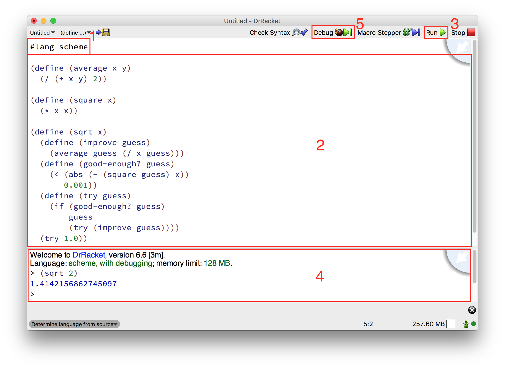

# Structure and Interpretation of Computer Programs (SICP)
This is a series of recorded lectures by Harold Abelson and Gerald Sussman given in 1986 to an incoming class of freshmen at MIT, where the SICP curriculum was taught for over 25 years. There is also [a book of the same name](http://sarabander.github.io/sicp/), which was used with the class. A PDF version [can be found here](https://github.com/sarabander/sicp-pdf/raw/master/sicp.pdf).

## Overview
Because this is an introductory course on computer science, many of the examples covered in the lectures might be review or be relatively simple compared to the large Capstone projects you've recently been working on. This is actually ideal for absorbing the lecture material as the key information we should derive from these lectures is the fundamental concepts of Computer Science that underly all of the code that we write.

The language used in these lectures and in the SICP text is known as [Scheme](http://www.schemers.org/), and it was created by Gerald Sussman and Guy Steele Jr. in 1970. Scheme is a dialect of a language called [LISP](https://en.wikipedia.org/wiki/Lisp_(programming_language)) which is one of the oldest computer languages, being invented in 1958.

[LISP and its derivatives](https://en.wikipedia.org/wiki/List_of_Lisp-family_programming_languages) form one major "branch" in the family tree of programming languages, specifically one that is based around the conceptual ideas of how to define a process using a computer language. These days, the style of programming that comes from that way of thinking is generally known as functional programming.

In contrast, the other major branch of the family tree is largely [derived from the C programming language](https://en.wikipedia.org/wiki/List_of_C-family_programming_languages), and these languages are all centered around the issue of how to instruct a computer to perform a particular process. Ruby and Javascript are both languages along this branch, and Javascript even uses what is known as "C-style" syntax (heavy emphasis on the curly braces).


## Installation Instructions
In order to follow along with the code from the lecture videos, we'll be using a program called DrRacket, which is the preferred code editor for another Lisp-family language known as [Racket](http://www.racket-lang.org/). Racket is a descendant of Scheme and includes all of the core features from it, while also supporting more modern operating systems and a broader set of programming fields.

You can install Racket (and DrRacket along with it) directly from your terminal:
```bash
$ brew cask install racket
```

If you get an error about `cask` not being found try running the following command:
```bash
$ brew tap caskroom/cask
```
and then run the first command again.

Once you have Racket installed, you can start up the DrRacket GUI by running the `drracket` command from your terminal.

### DrRacket Interface
The DrRacket GUI application combines a minimalist code editor that has syntax highlighting and parentheses balancing, with a fully-featured REPL and debugger.



1. For the code examples discussed in these lectures, always make sure to start with `#lang scheme` to indicate to DrRacket that we will be using the Scheme dialect of Lisp.
1. This is the definitions section, most equivalent to a text editor. You can enter definitions and any other code in here, and easily edit them in the same way you would with Atom.
1. Once you've entered your code in the definitions section, press the "Run" button to have DrRacket evaluate the code and start the REPL.
1. This is the REPL section, most equivalent to IRB. Once you've pressed the "Run" button you can enter code in here interactively and see its results. All of the definitions you've written in the definitions section will automatically be available to use here.
1. If you have any problems with your code that don't result in an error message (shown in the REPL section) you can press the "Debug" button to enter the debugger mode, which will allow you to step through your code one piece at a time.

## Scheme Syntax
Here's a quick primer on how to identify code from Scheme or other Lisp-family languages:

Ruby method:
```ruby
def hypotenuse(a, b)
  a2 = a * a
  b2 = b * b
  h2 = a2 + b2
  return Math.sqrt(h2)
end
```

Scheme method:
```scheme
(define (hypotenuse a b)
  (sqrt (+ (* a a)
           (* b b))))
```

See all those parentheses? That's probably the most distinctive visual feature of Lisp-family languages. Another significantly different syntactic feature of these languages is the use of "prefix" notation (`(verb noun noun)`) instead of "infix" notation (`noun verb noun` or `noun.verb(noun)`).

As we go through the lectures we'll talk more about the syntactic differences, and about some of the more subtle differences that get at the heart of how Lisp and C differ. Things such as why the Lisp version of the above code doesn't involve any assignment (`=`) statements.


## Lecture Videos
These lectures are from 1986... the production value is kinda low and the style is a bit cheesy. I especially like the wizard theme used in both the lecture intro/outro and the SICP book cover, but I'm a fantasy nerd. At the very least I hope you'll get a kick out of seeing what programming interfaces looked like 30 years ago.

### Lecture 1A - Overview and Introduction to Lisp
The video is [on Youtube](https://www.youtube.com/watch?v=2Op3QLzMgSY) and you can find the PDF [text transcript here](http://ocw.mit.edu/courses/electrical-engineering-and-computer-science/6-001-structure-and-interpretation-of-computer-programs-spring-2005/video-lectures/1a-overview-and-introduction-to-lisp/2Op3QLzMgSY.pdf).

#### TODO: Write some details about this lecture's contents
