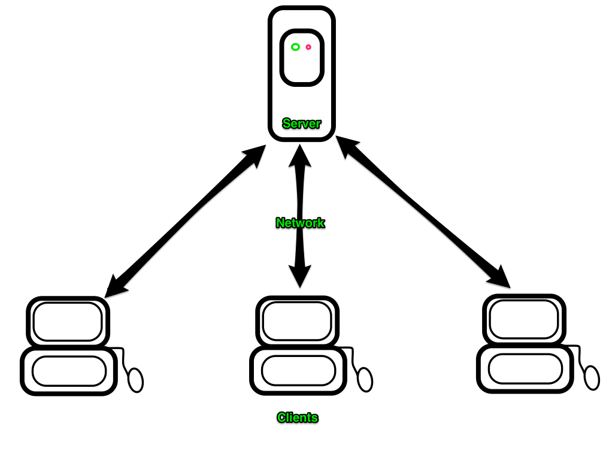

# Networking 101

A computer network is a collection of computers and devices connected using communication devices (routers, cables, wifi).

Computers communicate over a network by sending data over the connection.

There are many types of networks and architectures, but we're going to look primarily at the internet and client/server architecture.

Client/Server
-------------

A **Server** is a computer that provides a service to clients.

A **Client** is a computer that requests services from a server (your web browser, an ATM, your phone)



Communication (HTTP)
-------------

Hypertext Transfer Protocol (HTTP) function as a request-response protocol.

A client sends an HTTP request and a server sends back an HTTP response.

Each of these are just text sent over our network. A series of technologies take this text, carry it to the intended destination, and make sense of it.
Socket.tcp("localhost", 3000) {|sock|
  sock.print "GET / HTTP/1.1\r\n\r\n"
  sock.close_write
  puts sock.read
}
Request
```
GET / HTTP/1.1
User-Agent: curl/7.30.0
Host: localhost:8080
Content-Length: 6
Accept: */*

order_item[product_id]=4
```

Response
```
HTTP/1.1 200 OK
Content-Type: text/html
Server: WEBrick/1.3.1 (Ruby/2.1.2/2014-05-08)
Date: Mon, 22 Sep 2014 19:19:57 GMT
Content-Length: 21
Connection: Keep-Alive

A barebones rack app
```

Web Server
----------

The webserver is a running process on the server which monitors incoming HTTP requests
and respond with an HTTP response. In simpler times the web server would simply locate
an HTML file then read and return the contents. Remember when websites commonly had .html
at the end of the URL?

For our purposes we won't be using statically saved HTML files, but we'll use ruby
to generate the HTML content dynamically each time a request is made.

A webserver interfaces your application with incoming HTTP requests on the server.


