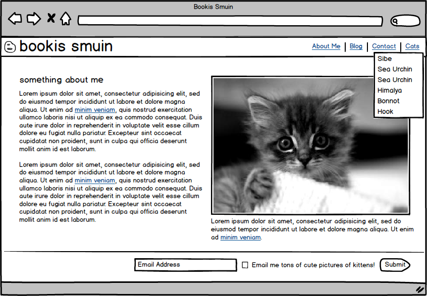

## Starting an HTML website

Add required html elements

    <!DOCTYPE html>
    <html>
      <head>
        <link  href="css/main.css" media="all" rel="stylesheet">
        <title>Bookis Smuin</title>
      </head>
      <body>
        <!-- Put your HTML here -->
      </body>
    </html>
    
The `<!DOCTYPE html>` should start every HTML page. This tells the browser which version of HTML we are writing. Browsers aren't too strict on this and we will always be using HTML5 we'll always use `<!DOCTYPE html>`

The `html` element is the outer most nest, we write all html within this element.

The `head` element is where we define information about/for the page, rather than writing the page itself.

The `title` tag sets the title on the browser header bar and browser tab text.

The `link` tag is used to link (think import) CSS pages. The CSS page is identified using the `href` attribute.

The `body` element is where we actually write the HTML that builds the visual portion of our page.

The `<!--  -->` is an HTML comment, similar to ruby's `#`, except HTML has an opening and closing statment. The comment goes between the `--`'s

-------

Next we'll create the css file. It's a good idea to put all of the css into a seperate file

    mkdir css
    touch css/main.css
    
CSS doesn't need any meta data. So the file can just sit until we're ready to write some CSS.

We can look at our web inspector console (right-click page and click "Inspect Element", then click "Console") to ensure that the file is properly being loaded. If the CSS isn't properly linked we should see an error that looks something like:

    Failed to load resource: The requested URL was not found on this server. (main.css, line 0)
    
This error will be different in every browser.

#### Implementing HTML

We'll start by making a mock up using apps such as

- [Balsamiq](http://balsamiq.com)
- [Skitch](http://evernote.com/skitch/)
- [InDesign](http://www.adobe.com/products/indesign.html)

I've started using Balsamiq:

This mockup has:

- Header
- Logo image
- Nav
- Dropdown menu
- Footer
- Form

First, create your own mock-up. Then start coding away.

I'll breifly go over how I coded my example mock-up above. You can find the completed design [on Github](https://github.com/Ada-Developers-Academy/daily-curriculum/tree/master/week5/monday/personal-website).

    <!DOCTYPE html>
    <html>
      <head>
        <link  href="css/main.css" media="all" rel="stylesheet">
        <title>Bookis Smuin</title>
      </head>
      <body>
        

          

            Bookis Smuin
            

              <ul class='nav-links'>
                <li><a href="/about">About Me</a></li>
                <li><a href="/blog">Blog</a></li>
                <li><a href="/contact">Contact</a></li>
                <li class='dropdown-link'>
                  <a href="#cats">Cats</a>
                  <ul class='dropdown'>
                    <li>Sea Urchin</li>
                    <li>Sea Urchin Jr.</li>
                    <li>Siberian Husky</li>
                    <li>Godzilla</li>
                  </ul>
                </li>
              </ul>
            

          

        

        

          

            

              <h2>Something about me</h2>
              

                Lorem ipsum dolor sit amet, consectetur adipisicing elit, sed do eiusmod tempor incididunt ut labore et dolore magna aliqua. Ut enim ad minim veniam, quis nostrud exercitation ullamco laboris nisi ut aliquip ex ea commodo consequat. Duis aute irure dolor in reprehenderit in voluptate velit esse cillum dolore eu fugiat nulla pariatur. Excepteur sint occaecat cupidatat non proident, sunt in culpa qui officia deserunt mollit anim id est laborum.
              

              

                Lorem ipsum dolor sit amet, consectetur adipisicing elit, sed do eiusmod tempor incididunt ut labore et dolore magna aliqua. Ut enim ad minim veniam, quis nostrud exercitation ullamco laboris nisi ut aliquip ex ea commodo consequat. Duis aute irure dolor in reprehenderit in voluptate velit esse cillum dolore eu fugiat nulla pariatur. Excepteur sint occaecat cupidatat non proident, sunt in culpa qui officia deserunt mollit anim id est laborum.
              

            

            

              </img>
              <blockquote>Apparently there is nothing that cannot happen today</blockquote>
               - Mark Twain
            

          

          

            

            <input type='text' placeholder="Email Address" />
            <label for="send_me_lots_of_pics_of_kitties">
              <input type="checkbox" name="send_me_lots_of_pics_of_kitties" value="yep" id="send_me_lots_of_pics_of_kitties">
              <small class='muted'>Send me lots of pics of kitties!</small>
              <input type="submit" name="submit" value="submit" id="submit">
            </label>

          

        

      </body>
    </html>
    
--------

    /* HTML Tag changes*/
    body {
      font-family: Helvetica, Arial;
      margin: 0;
      padding: 0;
      background-color: #aaa;
    }

    hr {
      border-top: 1px solid gray;
    }

    blockquote {
      font-size: 20px;
    }
    blockquote:before {
      content: '\201C';
    }

    blockquote:after {
      content: '\201D';
    }

    /* General */

    .container {
      width: 900px;
      margin: 0 auto;
    }

    .muted {
      color: gray;
    }

    .author {
      display: block;
      text-align: right;
      color: gray;
      margin-top: -30px;
    }

    /* Header & Nav */

    .header {
      background-color: #68996B;
      height: 50px;
      color: white;
    }

    .brand {
      font-size: 24pt;
      background: url(http://placekitten.com/40/40) no-repeat left center;
      height: 50px;
      display: inline-block;
      padding-left: 45px;
      line-height: 1.5;
    }

    .header .nav {
      float: right;
      position:relative;
    }

    ul li {
      position:relative;
      display: inline;
    }

    .nav ul li a {
      color: #163316;
      text-decoration: none;
      margin: 0 5px;
      background-color: #EEE8D7;
      padding: 8px;
      border-radius: 3px;
    }

    .nav ul li a:hover {
      background-color: #C6C0B1;
    }

    /* Dropdown Menu */
    ul.dropdown {
      display: none;
      width: 150px;
      margin: 0;
      padding: 0;
      position: absolute;
      top: 26px;
      left: 5px;
      background-color: #eee;
      color: black;
    }

    ul li:hover ul.dropdown {
      display: inline-block;
    }

    ul.dropdown li {
      display: block;
      padding: 5px;
    }

    ul.dropdown li:hover {
      background-color: gray;
      color: #fff;
    }

    /* Main Section*/

    div[role=main] {
      width: 890px;
      padding-top: 20px;
      background-color: white;
      padding: 10px 5px;
    }
    .main {
      float: left;
      width: 430px;
    }

    .main:not(:first-child) {
      margin-left: 20px;
    }

    /* Footer */

    .footer {
      clear: both;
      text-align: right;
    }

    