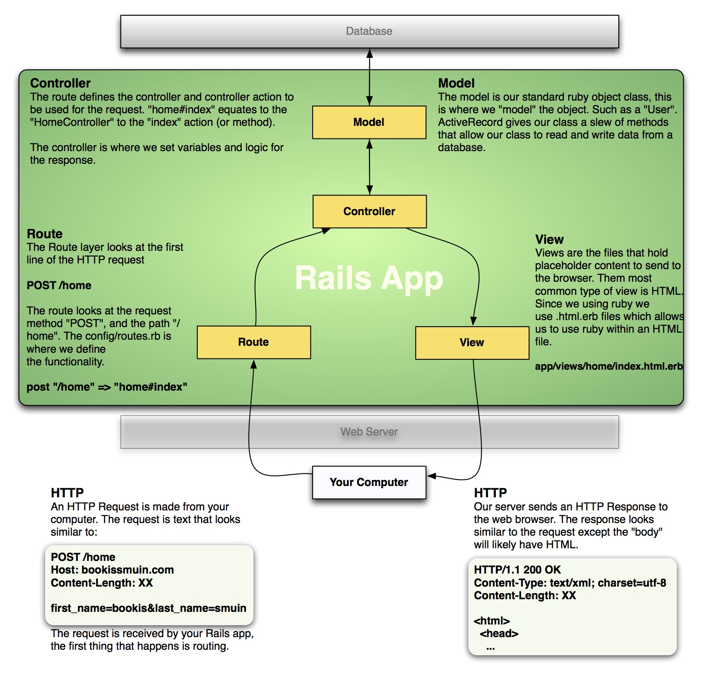

## Routes

In this section we will learn about the basics to Rails routing, including:

1. The HTTP request
2. `routes.rb` syntax
3. Relation to Controllers

### HTTP Request

HTTP is the language of the internet. Browsers send HTTP requests to our servers. A sample HTTP request could look as simple as:

    GET /users HTTP/1.1
    Host: adadevelopersacademy.org
    User-Agent: Web-sniffer/1.0.46 (+http://web-sniffer.net/)
    Referer: http://web-sniffer.net/

The two most important parts of this request are:

- `GET`, which is the request method. The most common request methods are `get`, `post`, `put`, `patch`, and `delete`.
- `/users`, which is the path.

#### Anatomy of `routes.rb`

Routes are analogous to an old-timey telephone switch board. When an HTTP request comes into our application our defined routes connect the request data to the correct Controller action. We define routes in our `config/routes.rb` file. The `routes.rb` file is generated by the `rails new` command.

    Some::Application.routes.draw do
      get "/users" => "users#index"
    end

Lets go over the pieces of this code, `Some::Application.routes.draw do` your Rails app will come with this portion already in the file. It's the code inside that defines our routes. A route definition starts with the request method, `get` in this example.

The next portion `"/users"`, this is what will be matched with the URL or path in the HTTP request.

Next we have a `=>`, think of this as the router, this points the request path to the controller and action where this request will go.

`"users#index"`, this is a cryptic way of defining the controller and action split by the `#`. This example would point to the `UsersController` to the `index` action.

