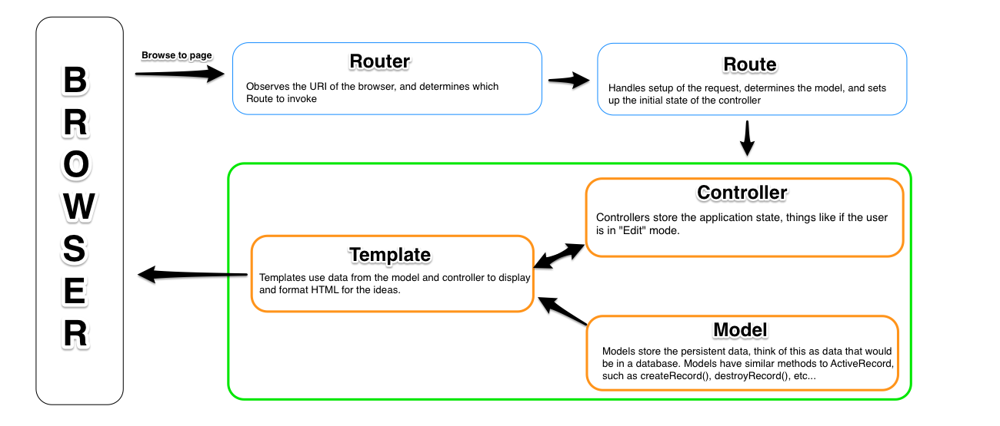

## What is Ember.js
### "A framework for creating ambitious web applications."

> "Ember is not Ruby on Rails. It's not a server. It follows MVC as used on desktop applications"

Ember development is meant to be URI driven, meaning we need to give thought
about the interfaces our users will need to interact with our data. Each URI is
mapped to a template (or a series of them) to style and present the data to the user.

In Ember a template is typically backed by a model, this is json data representing 
an object, usually coming from a server. When the underlying model changes, the 
DOM will automatically update.

## Basic Structure

Just as in Rails, there are a lot of files in this application, but there are those
that will matter to us and those that won't, I'll quickly go over the files that
we will be working with directly. the `app` directory is where everything we will
be working with will live, ignore everything outside of that dir (for now):

- **/app**
    - **/images**
    - **/scripts**
        - **/controllers** 
        - **/helpers**
        - **/models**
        - **/routes**
        - `router.js`
        - `main.js`
        - `templates.js`
    - **/styles**
    - **/templates**
    - `index.html`

Most of these dirs are pretty straight forward once you understand the basics
of ember. The name of the dir stores that js file declaring that kind of object.

A couple gotchas:

1. The `/app/scripts/templates.js` file is automatically generated when Grunt
auto compiles all of the handlebars templates in `/templates`. The `templates.js`
file should never be manually changed.

2. The `index.html` is the place to require all of our application files and their
dependencies. The actual `html` impelementation will happen in the `.handlebars` 
files in the `/templates` dir.

## Naming Conventions

In Ember, naming conventions are assumed. We have to be very careful about
the names we use for classes, objects, and files.

Given we are working with a resource named "users", follow the below naming 
conventions for Ember to work.

- Router
    - this.resource("users")
    - App.UsersRoute
- Controller
    - App.UsersController
- Model
    - App.User
- View
    - App.UsersView
- Template
    - users.handlebars
    
Here is an additional table of possible naming combinations:

|Route Name | Controller | Route	|Template|
|:-----------:|:-----------:|:-----------:|
|posts|	PostsController|PostsRoute|posts|
|posts.favorites|	PostsFavoritesController|	PostsFavoritesRoute|	posts/favorites|
|post|	PostController|	PostRoute|	post|

## Handlebars

[Handlebars](http://handlebarsjs.com/) is a javascript HTML templating system.
In a `.handlebars` file you can use `{{ }}` to print data and `{{# }}...{{/}}` as a 
block. Ember does a great job at seamlessly attaching your models into your handlebars
template. 

