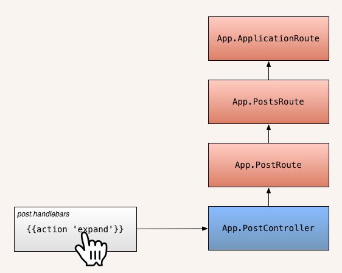

# More Ember

## Associations

`ember-data` provides a syntax for identifying and naming associations within
models. Similar to rails we have `hasMany` and `belongsTo`, these method replace
the data type of an attribute declaration within a model. In a model `kitten.js`
which we want to have many toys:

```js
App.Kitten = DS.Model.extend({
  name: DS.attr("string"),
  toys: DS.hasMany("toy", {async: true})
})
```

Now an instance of `Kitten` will have a method `toys` which will return an array
of `Toy` objects. The way we specify which `Toy` objects to find in JSON is
using an array of ID's, for example with the fixture data

```js
App.Kitten.FIXTURES = [
  {
    id: 1,
    name: "Urchin Jr.",
    toys: [1,3]
  }
]
```

When the `Kitten` with an ID of 1 is loaded, the `Toy` objects 1 and 3 will be
associated to it. The `{async: true}` portion is needed if you want this object
to handle the loading of the `Toy` data.

## Actions


Action are used for changing the state of the application or triggering application
behavior. This is typically when we want to change the content of the page but
we don't necassarily want to a new URL. What we would normally think of as HTTP POST, PATCH,
and DELETE requests, are great candidates for actions. As well as showing or hiding
some content.

Actions have a couple different components, the template helper `action` and
the definition of an action within the controller or route file. In a `.handlebars`
file we can use the `action` helper to bind an event (like clicking a link) to an
action.

```html
<a href="#likeKitten" {{ action "likeKitten" this }} class='btn'>Like</a>
```

The link we've just created is now attached to an action called `likeKitten`.
If we were to click on this link we'd see the following error in our web console:

```js
Uncaught Error: Nothing handled the action 'likeKitten'.
```

Now lets handle the action, in the route for this template we can define a list
of actions,

```js
App.KittensRoute = Ember.Route.extend({
  actions: {
    likeKitten: function (kitten) {
      console.log("I like this kitten " + kitten )
    },
  },
  model: function () {
    return [1,2,3,4];
  }
})
```

All actions are nested within the `actions` hash in a route or controller (both
will work). 

Here is a full example of a set of actions

```html
{{# unless isHidden }}
  <button {{action "hide"}} >Hide</button>
  {{#each}}
    
    <a href="#likeKitten" {{ action "likeKitten" this }} class='btn'>Like</a>
  {{/each}}
{{else}}
  <button {{action "show"}} >Show</button>
{{/unless}}
```

```js
/* Route */
App.KittensRoute = Ember.Route.extend({
  actions: {
    likeKitten: function (kitten) {
      console.log("I like this kitten " + kitten )
    },
    hoverKitten: function (kitten) {
      console.log("I hovered kitten " + kitten )
    }
    
  },
  model: function () {
    return [1,2,3,4];
  }
})

/* Controller */
App.KittensController = Ember.ArrayController.extend({
  actions: {
    hide: function () {
      this.set("isHidden", true)
    },
    
    show: function () {
      this.set("isHidden", false)
    }
  }
})
```

## Computed Properties
A Model's Computed properties are similar to methods on an ActiveRecord class,
you can use and manipulate the classes attributes to return a new value. For
example:

```js
App.Person = Ember.Model.extend({
  firstName: DS.attr("string"),
  lastName: DS.attr("string"),

  fullName: function() {
    return this.get('firstName') + ' ' + this.get('lastName');
  }.property('firstName', 'lastName')
});

person.get('fullName') // "Bookis Smuin"
```

The `fullName` attribute referes to a `function`, inside of this `function` we
are concatenating the `firstName` and `lastName` attributes joined by a space.

After ending the `function` we are calling `.property` and listing any attributes
that were used inside function. This tells the model to re-evaluate the function
anytime any of these attributes are modified. Any computed property will be 
updated within the view when the referenced attributes are changed.

Computed properties can even use other computed properties.

```js
App.Person = Ember.Model.extend({
  firstName: DS.attr("string"),
  lastName: DS.attr("string"),

  fullName: function() {
    return this.get('firstName') + ' ' + this.get('lastName');
  }.property('firstName', 'lastName'),
  
  reverseName: function() {
    return this.get("fullName").split("").reverse().join("");
  }
});

person.get('reverseName') // "niumS sikooB"
```
