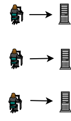
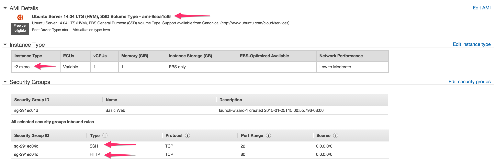
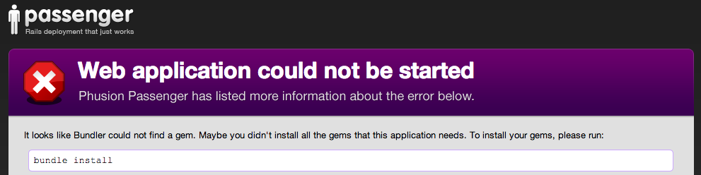
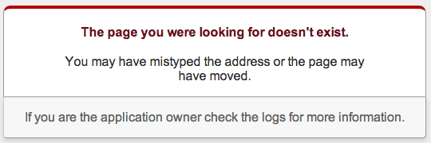

Provisioning and Deploying to an EC2 VPS
----------------------------------------
(Initially guest lecture from Jake _____)

# "They tell me I have to use this thing called a VPS for my Capstone project..."

**You:** Why? And what is it anyway?

**Me:** It's a remote computer that you fully control.

**You:** Oh, like Heroku!

**Me:** Yup. For our purposes the end-goal is the same: to publish your Rails app for the world to see. But now we'll get there by taking a different path.


# What does Heroku buy us?

It lets us easily:

1. Set up web servers
1. Deploy web applications
1. Scale to handle heavy traffic


# But at what cost?!

Heroku is a great solution, but so far it's a bunch of magic.

Relying on magic without understanding it is risky:

1. Don't know the incantations to diagnose/fix problems on the server.
1. Fewer opportunities to customize/optimize the server.
1. Many projects don't use Heroku; it's good to understand what they do instead.
1. Magic can be expensive.


# Connecting to Servers

Loading a website in the browser works because your computer and the server are having a conversation. They're talking using a protocol called HTTP.

```
Client                     Server
  |                          |
  |          request         |
  |------------------------->|
  |                          |
  |         response         |
  |<-------------------------|
  |                          |
```

HTTP is a great protocol for using websites, but not it's going to let us set up a web server. For that we need SSH.
SSH stands for **S**ecure **SH**ell, and it's just another communication protocol for computers.
SSH can also be used to securely copy files from one computer to another. This will be useful when it comes time to copy the Rails application code to the server.

# Now we need a server

A Heroku server would be fine, but remember we're trying to unravel Heroku's magic.

High-level requirements:

1. Must support Rails, database system, and any other dependencies of the Rails application
1. Must be accessible on the internet via HTTP and SSH


# Shared Web Hosting


Shared hosting is inexpensive, but provides little to no control over

- operating system
- software
- availability of system resources
    - processor (CPU)
    - memory (RAM)
    - storage (hard drive)


# Virtual Private Servers



VPSs are more expensive than shared hosting, but they let us control nearly everything. Beyond the free tiers, they can be less expensive than Heroku.

Ultimately, shared hosting isn't flexible enough to support Rails; we really need a VPS.


# Setting up a VPS on Amazon's EC2 service

Sign Up & Launch
-------
Sign up for [AWS](http://aws.amazon.com/). You'll need to give credit card, although
we will only be using the free tier. After signing up go to the [AWS Console](https://console.aws.amazon.com)
. Click on "Services", then "EC2". Click "Launch Instance", then follow the wizard to create an instance.

- Step 1: Select "Ubuntu Server 14.04 LTS (HVM), SSD Volume Type" (there is a checkbox on the left that says "free tier", this will helper filter the list)
- Step 2: The smallest instance (micro) should already be selected, just hit "Next: Configure Instance Details"
- Step 3-5: Use the defaults in all these steps, just click the "Next" button.
- Step 6: Change the "Security Group Name" to "Basic Web App", then Click "Add Rule", From the new dropdown, select "HTTP". Click "Review and Launch".
- Step 7: Verify that your page includes these things.

**Click Launch**
- Step 8: In the modale, select "Create a new pair", give the key a name ("ec2-ada"), then "Download Key Pair"
**Click Launch Instances**

Click on the link to the instance, it looks something like "i-aef4705f".

- Click "Elastic IPs" in the sidebar.
- Click "Allocate New Address"
- Click "Associate Address"
- Hight the "Instance" field to autofill with the instance you just created.

SSH
-----

Next we're going to SSH into the instance we just created. Go to the terminal and type:

```bash
mv ~/Downloads/ec2-ada.pem ~/.ssh/
chmod 400 ~/.ssh/ec2-ada.pem

ssh -i ~/.ssh/ec2-ada.pem ubuntu@54.152.39.2 # Copy the Elastic IP Address from EC2
# say 'yes' when it asks if you want to add to Known Hosts
```

Now we are SSH'd into ec2, were essentially in the Terminal of another computer.
But,this computer if pretty bare bones, so were going to have to install a bunch of things like
- RVM
- Ruby
- Postgresql
- A webserver (Apache & Passenger)

Install Fest
------------

While SSH'd into EC2:
```
sudo apt-get update
sudo apt-key adv --keyserver keyserver.ubuntu.com --recv-keys 561F9B9CAC40B2F7
sudo apt-get install apt-transport-https ca-certificates
sudo vi /etc/apt/sources.list.d/passenger.list
```
Add the following to the file, then save and quit (:wq):

```bash
deb https://oss-binaries.phusionpassenger.com/apt/passenger trusty main
```

Note: Do not copy and paste multiple lines at the same time.

```bash
sudo chown root: /etc/apt/sources.list.d/passenger.list
sudo chmod 600 /etc/apt/sources.list.d/passenger.list
sudo apt-get update
gpg --keyserver hkp://keys.gnupg.net --recv-keys D39DC0E3
\curl -sSL https://get.rvm.io | bash -s stable --ruby=2.2.0
source /home/ubuntu/.rvm/scripts/rvm
sudo apt-get install git
sudo apt-get install libapache2-mod-passenger
sudo a2enmod passenger
sudo service apache2 restart
sudo vi /etc/apache2/sites-available/waitlist.conf
```
Add the following to the file, then save and quit (:wq):
```bash
<VirtualHost *:80>
  ServerName 54.164.53.249
  DocumentRoot /var/www/waitlist/current/public
  ServerAdmin bookis.smuin@gmail.com
  PassengerRuby /home/ubuntu/.rvm/gems/ruby-2.2.0/wrappers/ruby
  <Directory "/var/www/waitlist/current/public">
    Options FollowSymLinks
    Require all granted
  </Directory>
</VirtualHost>
```

```bash
sudo a2dissite 000-default
sudo a2ensite waitlist
sudo service apache2 restart
sudo mkdir /var/www/waitlist
sudo chown -R $USER:$USER /var/www/waitlist/
sudo apt-get install postgresql postgresql-contrib libpq-dev
sudo -i -u postgres
createuser --interactive
```
Give the answers:
```
ubuntu
n
y
n
```
```bash
createdb waitlist_production
exit
sudo vi ~/.bash_profile
```
Add the following to the file, then save and quit (:wq):
```bash
export SECRET_KEY_BASE=db48bfa9e94bad023e877e791decac8ab7b0315f7153cb61c5f26d82170713fea412035121dc8d59f6a6c27fad5070f48dc1f2a3c03fa388dae816bcd6aca58b
```
```
sudo service apache2 restart
```

# Web Application Servers: wha...?

The VPS needs software to facilitate conversations between your Rails app and all the browsers connecting to it.

We already installed a popular web application server called Apache. By default Apache knows how to speak HTTP, but to speak 'Rails' it needs a module called Passenger. We just installed that too!

```
| = = = = |  |= = = = = = = = = = = = = = = = |
| Client  |  |           S e r v e r          |
| = = = = |  |= = = = = = = = = = = = = = = = |
| Browser |  |Apache      Passenger      Rails|
| = = = = |  |= = = = = = = = = = = = = = = = |
     |          |             |            |
     |--------->|             |            |
     |          |------------>|            |
     |          |             |----------->|
     |          |             |<-----------|
     |          |<------------|            |
     |<---------|             |            |
     |          |             |            |
```


# Install Capistrano gem

[Capistrano](https://github.com/capistrano/capistrano) is a helpful gem for deploying your Rails code.

Follow the latest installation and configuration instructions [here](https://github.com/capistrano/capistrano/blob/master/README.md). To start, add the Capistrano dependency to your Gemfile and build out the default skeleton. While you're at it, add the `therubyracer` gem.

```ruby
group :development do
  gem 'capistrano'
  gem 'capistrano-rvm'
  gem 'capistrano-bundler'
  gem 'capistrano-rails'
  gem "capistrano-passenger"
end

gem 'therubyracer', platforms: :ruby
```

And of course run bundler to actually install the gems.

```bash
$ bundle install
```

Change the production database setting to match our EC2 instance, in config/database.yml

```yml
production:
  <<: *default
  database: waitlist_production
  username: ubuntu # CHANGE THIS
  password: <%= ENV['WAITLIST_DATABASE_PASSWORD'] %>
```

# Capistrano stages

In our case we only need a deployment stage for the new production server.

```bash
bundle exec cap install STAGES=production
```

If you had clients or a QA team who need to vet changes before they're deployed to prod, you could also use an intermediary stage that's widely accessible (often called 'staging').


# Configure Capistrano

Tell Capistrano to use the helper gems we installed. Open `Capfile` and uncomment these lines:

```ruby
require 'capistrano/rvm'
# require 'capistrano/rbenv'
# require 'capistrano/chruby'
require 'capistrano/bundler'
require 'capistrano/rails/assets'
require 'capistrano/rails/migrations'
require 'capistrano/passenger'
```

Open `config/deploy.rb` and fix these settings:

```ruby
set :application, 'waitlist'
set :repo_url, 'git@github.com:Ada-Developers-Academy/ec2-demo.git'
set :use_sudo, false

set :deploy_to, '/var/www/waitlist'
```

# Production stage configuration

Open `config/deploy/production.rb`.

1. Comment out the following three lines:
```ruby
# role :app, %w{ubuntu@54.152.21.221}
# role :web, %w{ubuntu@54.152.21.221}
# role :db,  %w{ubuntu@54.152.21.221}
```
1. Change all the `example.com`s to the public DNS.
2. Change all the `deploy` user references to `ubuntu`, the primary user on the VPS.
3. Add a server configuration section like this:

```
server '54.152.21.221',
  user: 'ubuntu',
  roles: %w{web app db},
  ssh_options: {
    keys: %w(/Users/YOUR_USERNAME/.ssh/[pem file name].pem),
    forward_agent: false,
    auth_methods: %w(publickey)
  }
```

# Attempt deployment via Capistrano

To see the list of commands supported by `cap`, run

```bash
$ bundle exec cap -T
```

We already used `install`. Now we're interested in `deploy`.

```bash
$ bundle exec cap production deploy --trace
```

You'll probably see an error like this:

```
DEBUG [f96c1cb9] 	Permission denied (publickey,password).
DEBUG [f96c1cb9] 	fatal: Could not read from remote repository.
DEBUG [f96c1cb9]
DEBUG [f96c1cb9] 	Please make sure you have the correct access rights
DEBUG [f96c1cb9] 	and the repository exists.
```

or

```
DEBUG [a69573ff] Command: ( GIT_ASKPASS=/bin/echo GIT_SSH=/tmp/waitlist/git-ssh.sh /usr/bin/env git ls-remote --heads git@github.com:Ada-Developers-Academy/ec2-demo.git )
cap aborted!
SSHKit::Runner::ExecuteError: Exception while executing as ubuntu@54.152.39.2: git exit status: 127
git stdout: Nothing written
git stderr: Nothing written
```

Look in the `config/deploy.rb` file. The `:repo_url` setting indicates what git repo Capistrano should read from when deploying code. The git server doesn't have SSH access to the VPS, so when Capistrano tries to copy from the git server to prod it's rejected. We can fix that by setting up a deployment key.


# Deployment Keys

Both [GitHub](github.com) and [GitLab](gitlab.com) make this really easy. Here's how to do it in GitHub.

1. Log into GitHub and open your project's page.
1. Click "Settings" and then "Deploy Keys".
1. Click "Add deploy key"
1. Run the following command on EC2
1. Run `ssh-keygen -t rsa -C "[your GitHub email address]"`
1. Press enter through all the prompts until you're returned to the terminal prompt
1. Run `cat ~/.ssh/id_rsa.pub` (**WARNING:** don't forget the "pub" part)
1. Copy the entire output into the Key section on GitHub and give it a title
1. Click "Add key"


# Retry deployment

```bash
$ bundle exec cap production deploy --trace
```

If you see an error like this...

```
DEBUG [06ffe91f] 	mkdir:
DEBUG [06ffe91f] 	cannot create directory ‘/var/www/waitlist’
DEBUG [06ffe91f] 	: Permission denied
```

Log onto the server, create the directory, and assign ownership to the `ubuntu` user.

```bash
$ sudo mkdir /var/www/waitlist
$ sudo chown -R ubuntu /var/www/waitlist
$ sudo chgrp -R ubuntu /var/www/waitlist
```

Or an error like this:

```
DEBUG [3309bb27] 	touch:
DEBUG [3309bb27] 	cannot touch ‘/var/www/waitlist/releases/20140402184020/tmp/restart.txt’
DEBUG [3309bb27] 	: No such file or directory
```

Add an empty `tmp/restart.txt` file to your local repo, commit, push, and try again. You may have to tweak the `.gitignore` file.


# Browser test

Navigate to your server's public DNS in the browser and cross your fingers.

If Passenger complains with an error about `bundle install`. In that case you may have forgotten to install the Capistrano helper gems like `capistrano-bundler` and require them in the `Capfile`.



Once everything's working development and deployment will feel a lot more like Heroku.


# Deploy a bug...intentionally

Capistrano has a nifty way to help us recover from a bad deployment. Let's try it out.

Comment out the `root` route in the `config/routes.rb`, commit, push, and deploy.




# Rollbacks to the rescue

Eww, we don't want that. Rollback to where things were good.

```bash
$ bundle exec cap production deploy:rollback --trace
```

Ah, that's better.


