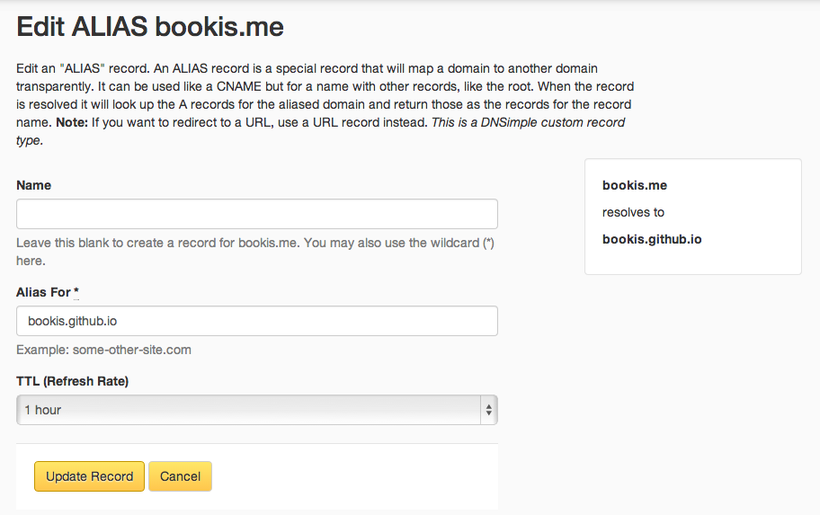

# DNS Configuration

DNS (Domain Name System) is the process in mapping easy to remember domains names
(google.com) to hard to remember IP addresses.  

## IP Address

An IP (Internet Protocol) address is used for locating a server (or other device) 
on the internet. Typically we see IPv4, An IPv4 address is composed of 4 bytes, 
which is 32 bits, each byte is represented in a decimal number (up to 255), 
for example `171.17.89.1`. IPv4 has a total pool 4,294,967,296 possible addresses.

IPv6 is a solution that will increase the pool to 3.4×10^38. An IPv6 addresses
are composed of 128 bits `2001:0db8:85a3:0000:0000:8a2e:0370:7334`, represented
by 8 hexidecimal values seperated by colons.

An IP address is like a websites phone number, this is the number you input to 
contact the site. But no one wants to remember this number. So we map the number
to a name (domain), like a phone book.

## Domain

Domain names consist of many potential parts, broken down by hierarchy, each section
is seperated by a `.`, domain hierarchy starts at the right most word, moving left.
The highest level of a domain is the TLD (top level domain) such as `.com`, moving
left we have a subcategory of the TLD, such as `google`, and to the left of this
is a subdomain, such as `www`. Almost any number of levels can exist. 

ICANN (Internet Corporation for Assigned Names and Numbers) is responsible for
managing the TLD's (`.com`). ICANN is also responsible for authorizing domain name
registrars (such as GoDaddy™). Domain name registrars are in the business of registering
domain names and mapping the domain to IP addresses

So to register a domain we can use on of the domain registrars (hint: never use GoDaddy)
My favorite for registration and configuration is http://dnsimple.com, but you might
want to check out https://domai.nr/ as a tool to search for domains. Domains are
priced from $0.99 up to millions, but typically run from $10-$50 depending on the
TLD.

## DNS
After purchasing a domain, you will use the domain registrars tools to manage
the DNS configuration. There are many [types of configurations](http://en.wikipedia.org/wiki/List_of_DNS_record_types):

### NS Record
NS (Name Server) records indicate who the authoritative name server is, when registering
your domain with a registrar they will set the NS records to their own server. This
means that any request to your domain will first contact their server to resolve
the requested IP Address. Even when registering with a given registrar, you can 
change your NS records to any value you'd like.

### A Record
A records are a direct mapping of a domain to an IPv4 address.

### CNAME Record
Maps a sub-domain to a different domain. This allows for an intermediary server to manage
where the domain is mapped to without having to assign a static IP address. For
instance Heroku is a cloud service, your IP address may change over time, but
we can add a CNAME for our domain to the `.herokuapp` name of our application, then
Heroku can manage the rest. The problem with CNAME records is that they can't map
to a root domain, they must map to a subdomain, such as `www`

### Alias Record

[Alias](http://blog.dnsimple.com/2011/11/introducing-alias-record/) records are a combination of the above two, they are mappings between two
domains. Alias records are not an industry standard yet. But, they are the solution
for using cloud based services and root domains. Not many DNS providers support
ALIAS records yet.

## Setting up Github Pages
We going to walk through a setting up DNS for mapping `bookis.me` to a [Github Pages](http://pages.github.com/) repo.
[Github's guide](https://help.github.com/articles/setting-up-a-custom-domain-with-pages)

Start by creating a file called `CNAME` in the root of the directory (this is specific to github pages)
in this file we will put the domain we want this repo to map to:

```bash
bookis.me
```

Next, I'll open the DNSimple dashboard for my domain and add an ALIAS record pointing
to my github pages subdomain `bookis.github.io`.



Wait 10 minutes (up to 72 hours). And go to http://bookis.me. Ta Da.

## Other services

Each service has a different DNS setup, most will give you instructions for
configuring your DNS records. Here are a couple of the guides:

- [Heroku](https://devcenter.heroku.com/articles/custom-domains)
- [Linode](https://library.linode.com/adding-dns-records)
- [Amazon S3 Bucket Hosting](http://docs.aws.amazon.com/AmazonS3/latest/dev/website-hosting-custom-domain-walkthrough.html)