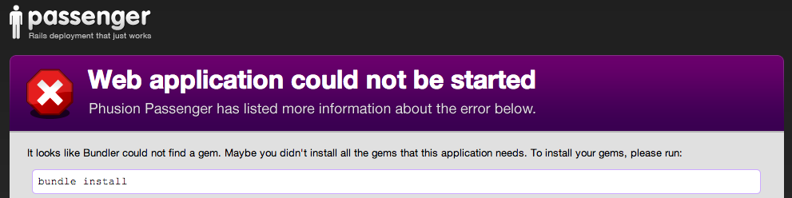

Provisioning and Deploying to an EC2 VPS
----------------------------------------
(A guest lecture from Jake _____)

# "They tell me I have to use this thing called a VPS for my Capstone project..."

**You:** Why? And what is it anyway?

**Me:** It's a remote computer that you fully control.

**You:** Oh, like Heroku!

**Me:** Yup. For our purposes the end-goal is the same: to publish your Rails app for the world to see. But now we'll get there by taking a different path.


# What does Heroku buy us?

It lets us easily:

1. Set up web servers
1. Deploy web applications
1. Scale to handle heavy traffic


# But at what cost?!

Heroku is a great solution, but so far it's a bunch of magic.

Relying on magic without understanding it is risky:

1. Don't know the incantations to diagnose/fix problems on the server.
1. Fewer opportunities to customize/optimize the server.
1. Many projects don't use Heroku; it's good to understand what they do instead.
1. Magic can be expensive.


# Connecting to Servers

Loading a website in the browser works because your computer and the server are having a conversation. They're talking using a protocol called HTTP.

```
Client                     Server
  |                          |
  |          request         |
  |------------------------->|
  |                          |
  |         response         |
  |<-------------------------|
  |                          |
```

HTTP is a great protocol for using websites, but not it's going to let us set up a web server. For that we need SSH.


# SSH Crash Course

SSH stands for **S**ecure **SH**ell, and it's just another communication protocol for computers. Let's try it.

Pick a random user: `ada1`, `ada2`, `ada3`, ... `ada100`. Your password is the same.

It's okay if some people have the same user.

Now open your terminal and connect.

```bash
$ ssh ada58@[some ip]
Password:ada58
```

Notice how the prompt changed? You're connected to a Linux machine running on my laptop. Try typing in `watch -n1 'who'` to monitor which users are connected. As people log in and out the output should change.

SSH can also be used to securely copy files from one computer to another. This will be useful when it comes time to copy the Rails application code to the server.


# Now we need a server

A Heroku server would be fine, but remember we're trying to unravel Heroku's magic. 

High-level requirements:

1. Must support Rails, database system, and any other dependencies of the Rails application
1. Must be accessible on the internet via HTTP and SSH


# Shared Web Hosting


Shared hosting is inexpensive, but provides little to no control over

- operating system
- software
- availability of system resources
    - processor (CPU)
    - memory (RAM)
    - storage (hard drive)


# Virtual Private Servers


VPSs are more expensive than shared hosting, but they let us control nearly everything. Beyond the free tiers, they can be less expensive than Heroku.

Ultimately, shared hosting isn't flexible enough to support Rails; we really need a VPS.


# Setting up a VPS on Amazon's EC2 service

EC2 is short for Elastic Compute Cloud. Using it feels a lot like buying parts for a custom computer. What we're really doing is renting a personal computer in the cloud.

Fortunately EC2 provides a [free tier](http://aws.amazon.com/free/). Rails can run just fine on it.

1. Open the [AWS Console](https://console.aws.amazon.com) and click EC2.
1. Select the latest version of Ubuntu Linux that's marked as free tier eligible.
1. Choose the instance type. The *t1.micro* with all the default settings will be a fine starting point.
1. Add EBS storage (basically a hard drive).
1. Set up the security group and allow HTTP traffic.
1. Click launch.
1. Set up a key pair so you can securely SSH into the new server. Keep careful track of this new file (and *never* commit it to any of your public git repositories!).
1. Click "Launch instance".
1. Bookmark any helpful links.


# SSH into the server

To securely connect to the VPS you'll first have to set up some things on your laptop. Follow the instructions [here](http://docs.aws.amazon.com/AWSEC2/latest/UserGuide/AccessingInstancesLinux.html).

Look at the new instance in the AWS console and find the public DNS. You'll also need the key file that you downloaded when you created the VPS.


```bash
$ ssh -i [key file] ubuntu@[vps public dns]
```

You can simplify this process storing some of this information in your `~/.ssh/config` file.


# Use Ubuntu's package manager to install several dependencies

A package manager is a lot like an app store for hackers. You can search for and install programs. If you've ever used [Homebrew](http://brew.sh/) to install software on your laptop, it's really similar.

```bash
$ sudo apt-get update
$ sudo apt-get -y upgrade
$ sudo apt-get -y install git apache2 postgresql \
     libopenssl-ruby libcurl4-openssl-dev \
     apache2-threaded-dev libapr1-dev \
     libaprutil1-dev
```

# Install RVM, Ruby, and Essential Gems

This process is exactly like what you did on your laptop during the [installfest](https://github.com/Ada-Developers-Academy/daily-curriculum/blob/master/week01/monday/installfest.md#rvm-installation) on day 1.

Start by installing [RVM](http://rvm.io).

```bash
$ \curl -sSL https://get.rvm.io | bash -s stable
$ source /home/ubuntu/.rvm/scripts/rvm
```

Then use RVM to install Ruby 2.0.0.

```bash
$ rvm install 2.0.0
$ rvm use 2.0.0 --default
```

And now we can install the Rails, Bundler, and Passenger gems.

```bash
$ gem install rails bundler passenger --no-ri --no-rdoc
```

# Install Passenger module for Apache

[Apache](http://httpd.apache.org/) and [Passenger](https://www.phusionpassenger.com/) may be unfamiliar. In short, Apache and Passenger translate between browser-speak and Rails-speak.

1. Set aside some hard drive space as virtual memory (aka swap)

```bash
$ sudo dd if=/dev/zero of=/swap bs=1M count=1024
$ sudo mkswap /swap
$ sudo swapon /swap
```

Go through interactive passenger setup process:

```bash
$ passenger-install-apache2-module
```

Follow its recommendations for passenger module loading and configuration, create an
passenger configuration file `sudo vim /etc/apache2/conf-enabled/passenger.conf`

```
LoadModule passenger_module /home/ubuntu/.rvm/gems/ruby-2.0.0-p451/gems/passenger-4.0.41/buildout/apache2/mod_passenger.so
   <IfModule mod_passenger.c>
     PassengerRoot /home/ubuntu/.rvm/gems/ruby-2.0.0-p451/gems/passenger-4.0.41
     PassengerDefaultRuby /home/ubuntu/.rvm/gems/ruby-2.0.0-p451/wrappers/ruby
   </IfModule>
```
(or whatever version is spit out at the end of the passenger-install-apache2-module)

# Web Application Servers: wha...?

The VPS needs software to facilitate conversations between your Rails app and all the browsers connecting to it.

We already installed a popular web application server called Apache. By default Apache knows how to speak HTTP, but to speak 'Rails' it needs a module called Passenger. We just installed that too!

```
| = = = = |  |= = = = = = = = = = = = = = = = |
| Client  |  |           S e r v e r          |
| = = = = |  |= = = = = = = = = = = = = = = = |
| Browser |  |Apache      Passenger      Rails|
| = = = = |  |= = = = = = = = = = = = = = = = | 
     |          |             |            |
     |--------->|             |            |
     |          |------------>|            |
     |          |             |----------->|
     |          |             |<-----------|
     |          |<------------|            |
     |<---------|             |            |
     |          |             |            |
```


# Create a dummy Rails app on the VPS to test Apache/Passenger

While SSHed into the VPS, navigate to `/var/www` and create a new Rails project.

```bash
$ cd /var/www
$ rvmsudo rails new crash-test-dummy
```

If you run into problems using `rvmsudo` take a look at [this page](https://rvm.io/integration/sudo).


# Tell Apache what it needs to know about your app

Create a `crash-test-dummy.conf` file in `/etc/apache2/sites-available`. Be sure to replace the `ServerName` part with your server's public DNS.

```
<VirtualHost *:80>
    ServerName ec2-184-72-148-221.compute-1.amazonaws.com
    DocumentRoot /var/www/crash-test-dummy/public
    <Directory /var/www/crash-test-dummy/public>
        Allow from all
        Options -MultiViews
    </Directory>
</VirtualHost>
```

Tell Apache to start using this new configuration by running `sudo a2ensite crash-test-dummy.conf`.

For more details on configuring Passenger, refer to [this section](http://www.modrails.com/documentation/Users%20guide%20Apache.html#_deploying_a_rack_based_ruby_application_including_rails_gt_3) of the docs.


# Test the dummy Rails app

1. Restart Apache: `sudo service apache2 restart`
1. Paste the server's public DNS into your web browser


Notice the `/var/www/crash-test-dummy/` lines. Passenger is successfully reading the dummy project. It's complaining due to the dummy project's lack of required gems, but that's no surprise. At least we can be confident in the Apache/Passenger configuration!

# Where to go from here?

We've got a couple options:

1. Continue developing the `crash-test-dummy` project *on* the production server.
1. Develop on our laptops and periodically deploy changes to production.

On the balance, the first option would be super frustrating.

- requires developing completely in the terminal (no Sublime here)
- all changes, including major bugs, would be published to the world immediately
- no separation of test/production data
- development would require an internet connection

Let's forget about the crash-test-dummy project. We'll work locally and deploy to production on our terms.


# Start a Rails app on your laptop

```bash
$ rails new my-spiffy-project
$ cd my-spiffy-project
$ git init .
$ git add .
$ git commit -m "initial commit"

# deploy to a git server
$ git remote add origin git@scm.twiggilybeard.com:mekaj/ada-deployment-demo.git
$ git push -u origin master
```

...or simply continue with a project you've already started. Keep in mind that syncing to a remote git repo that's internet-accessible will become important.


# Create a basic homepage

Set up a new route in `config/routes.rb`

```ruby
root 'welcome#index'
```

Generate a default welcome controller

```bash
$ rails generate controller Welcome index
```

Confirm it works

```bash
$ rails s
```

Don't forget to git commit and push.


# Install Capistrano gem

[Capistrano](https://github.com/capistrano/capistrano) is a helpful gem for deploying your Rails code.

Follow the latest installation and configuration instructions [here](https://github.com/capistrano/capistrano/blob/master/README.md). To start, add the Capistrano dependency to your Gemfile and build out the default skeleton. While you're at it, add the `rubyracer` gem.

```ruby
group :development do
  gem 'capistrano'
  gem 'capistrano-rvm'
  gem 'capistrano-bundler'
  gem 'capistrano-rails'
end

gem 'therubyracer', platforms: :ruby
```

And of course run bundler to actually install the gems.

```bash
$ bundle install
```


# Capistrano stages

In our case we only need a deployment stage for the new production server.

```bash
$ bundle exec cap install STAGES=production
```

If you had clients or a QA team who need to vet changes before they're deployed to prod, you could also use an intermediary stage that's widely accessible (often called 'staging').


# Configure Capistrano

Tell Capistrano to use the helper gems we installed. Open `Capfile` and uncomment these lines:

```ruby
require 'capistrano/rvm'
require 'capistrano/bundler'
require 'capistrano/rails/assets'
require 'capistrano/rails/migrations'
```

Open `config/deploy.rb` and fix these settings:

```ruby
set :application, 'my-spiffy-project'
set :repo_url, 'git@scm.twiggilybeard.com:mekaj/ada-deployment-demo.git'
set :use_sudo, false

set :deploy_to, '/var/www/my-spiffy-project'
```

And uncomment this line in the `:restart` task. Whenever Capistrano deploys to production this code will tell Apache to restart so the new changes take effect.

```ruby
execute :touch, release_path.join('tmp/restart.txt')
```

# Production stage configuration

Open `config/deploy/production.rb`.

1. Change all the `example.com`s to the public DNS.
2. Change all the `deploy` user references to `ubuntu`, the primary user on the VPS.
3. Add a server configuration section like this:

```
server 'ec2-184-72-148-221.compute-1.amazonaws.com',
  user: 'ubuntu',
  roles: %w{web app},
  ssh_options: {
    keys: %w(/Users/jacobmitchell/.ssh/[pem file name].pem),
    forward_agent: false,
    auth_methods: %w(publickey)
  }
```


# Attempt deployment via Capistrano

To see the list of commands supported by `cap`, run

```bash
$ bundle exec cap -vT
```

We already used `install`. Now we're interested in `deploy`.

```bash
$ bundle exec cap production deploy --trace
```

You'll probably see an error like this:

```
DEBUG [f96c1cb9] 	Permission denied (publickey,password).
DEBUG [f96c1cb9] 	fatal: Could not read from remote repository.
DEBUG [f96c1cb9]
DEBUG [f96c1cb9] 	Please make sure you have the correct access rights
DEBUG [f96c1cb9] 	and the repository exists.
```

Look in the `config/deploy.rb` file. The `:repo_url` setting indicates what git repo Capistrano should read from when deploying code. The git server doesn't have SSH access to the VPS, so when Capistrano tries to copy from the git server to prod it's rejected. We can fix that by setting up a deployment key.


# Deployment Keys

Both [GitHub](github.com) and [GitLab](gitlab.com) make this really easy. Here's how to do it in GitHub.

1. Log into GitHub and open your project's page.
1. Click "Settings" and then "Deploy Keys".
1. Click "Add deploy key"
1. In another terminal window, log into your VPS
1. Run `ssh-keygen -t rsa -C "[your GitHub email address]"`
1. Press enter through all the prompts until you're returned to the terminal prompt
1. Run `cat ~/.ssh/id_rsa.pub` (**WARNING:** don't forget the "pub" part)
1. Copy the entire output into the Key section on GitHub and give it a title
1. Click "Add key"


# Retry deployment

```bash
$ bundle exec cap production deploy --trace
```

If you see an error like this...

```
DEBUG [06ffe91f] 	mkdir:
DEBUG [06ffe91f] 	cannot create directory ‘/var/www/my-spiffy-project’
DEBUG [06ffe91f] 	: Permission denied
```

Log onto the server, create the directory, and assign ownership to the `ubuntu` user.

```bash
$ sudo mkdir /var/www/my-spiffy-project
$ sudo chown -R ubuntu /var/www/my-spiffy-project
$ sudo chgrp -R ubuntu /var/www/my-spiffy-project
```

Or an error like this:

```
DEBUG [3309bb27] 	touch:
DEBUG [3309bb27] 	cannot touch ‘/var/www/my-spiffy-project/releases/20140402184020/tmp/restart.txt’
DEBUG [3309bb27] 	: No such file or directory
```

Add an empty `tmp/restart.txt` file to your local repo, commit, push, and try again. You may have to tweak the `.gitignore` file.


# After successful deployment, configure Apache

We already have Apache configured for the `crash-test-dummy` project on the production server. Now we need something similar for the real project.

```bash
$ cd /etc/apache2/sites-available
$ sudo cp crash-test-dummy.conf my-spiffy-project.conf
```

Edit the new file to point to the deployment directory.

```
...
  DocumentRoot /var/www/my-spiffy-project/current/public
  <Directory /var/www/my-spiffy-project/current/public>
...
```

Tell Apache to stop serving the `crash-test-dummy` and start serving `my-spiffy-project`.

```bash
$ sudo a2dissite crash-test-dummy.conf
$ sudo a2ensite my-spiffy-project.conf
$ sudo service apache2 reload
```


# Browser test

Navigate to your server's public DNS in the browser and cross your fingers.

If Passenger complains with an error about `bundle install`. In that case you may have forgotten to install the Capistrano helper gems like `capistrano-bundler` and require them in the `Capfile`.



Once everything's working development and deployment will feel a lot more like Heroku.


# Deploy a bug...intentionally

Capistrano has a nifty way to help us recover from a bad deployment. Let's try it out.

Comment out the `root` route in the `config/routes.rb`, commit, push, and deploy.


# Rollbacks to the rescue

Eww, we don't want that. Rollback to where things were good.

```bash
$ bundle exec cap production deploy:rollback --trace
```

Ah, that's better.


