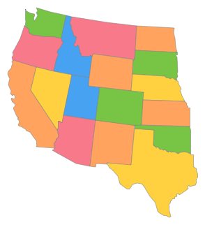
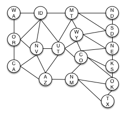
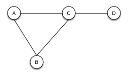
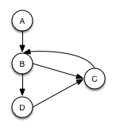

# Graphs

A graph is a data structure used to model relationships between data. A graph consists of a collection of *vertices* (or *nodes*), and *edges*. Nodes are used to store our data, and edges represent relationships between nodes.

### Example: A Graph of States

Suppose we want to make an app that maps road trip routes through the Western United States. For any start and end state, we want our software to produce a couple lists of states that we could pass through on our drive.

One way to build our routing software would be to build an graph representing the states and their immediate neighbors.

So, starting with a map of the states:



We can represent each state as a vertex and each border between two adjacent states as an edge. This allows us to build a graph representation like:



By building a graph, we've a given ourselves a convenient representation of the states and their relationships to one another that we can use to solve our problem.

## Undirected Graphs

In an *undirected graph*, each edge is associated with exactly two vertices. Since each edge uniquely connects a pair of vertices, we can name each edge with its vertex pair. For example:



In the above graph we have 4 nodes, A, B, C, and D, connected by 4 edges: AB, AC, BC, and CD. Since there can only be one edge connecting any two vertices, BA == AB.

Our graph of states is an undirected graph. In that example, we can see this symmetry of edges: whether we call it the Washington-Idaho border or the Idaho-Washington border it's pretty clear that we're talking about the same relationship.

## Directed Graph

In a *directed* graph or *digraph*, each edge has an associated directionality. We draw directed graphs using arrows for the edges:



In this case, we can only travel along an edge *in the direction of the arrow*.

So, in the above graph we have the following edges: AB, BD, BC, DC, and CB. Note that we *don't* necessarily have the reciprocal edges. While we can travel from A to B along edge AB, there's no way to get back from B to A; no edge exists that points in that direction!

Although directed graphs are a bit more complex conceptually, they're actually easier to implement than undirected graphs and, in general, more common.

Here's a simple implementation of an directed graph node in Ruby:

```ruby
class DirectedGraphNode
  attr_accessor :data, :adjacent_nodes

  def initialize(data)
    @data = data
    @adjacent_nodes = []
  end
end
```

We can just store an array of references to adjacent nodes–this is a natural representation that maintains the directional property.

FWIW, here's a JavaScript version using a prototypal inheritance pattern:

```javascript
var Node = {
  init: function (data) {
    this.data = data;
    this.adjacentNodes = [];
    return this;
  }
}

// create using var n = Object.create(Node).init(data)!
```

## Moar

* Implement an undirected graph in ruby.
* What's the relationship between a linked list and directed graph?
* How could you detect a cycle in a directed graph?
